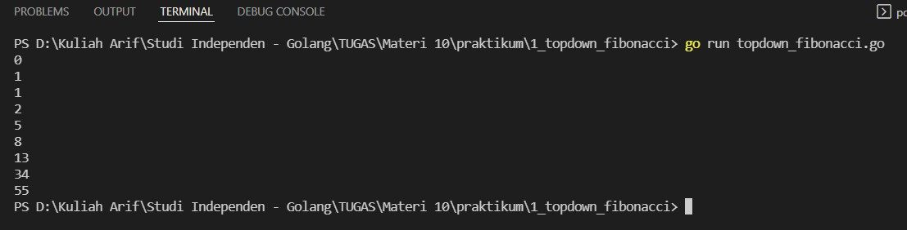
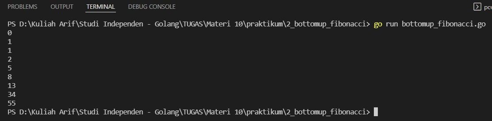
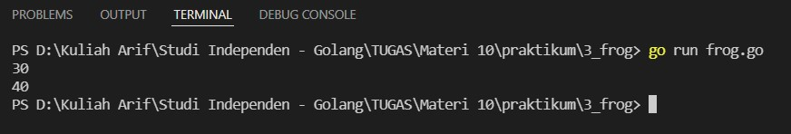

# (10) Dynamic Programming

## Resume
Dalam materi ini, yang dipelajari adalah :
1. Dynamic Programming
2. Top-down with memoization
3. Bottom-up with tabulation

### Dynamic Programming
Dynamic Programming adalah teknik algoritma untuk menyelesaikan masalah optimasi dengan membreakdown menjadi subproblem yang kecil dan memanfaatkan solusi optimal ke overall problem. karakteristik dynamic programming adalah overlapping subproblem dan optimal structure property. metode dynacim programming ada top-down menggunakan memorization dan bottom-up menggunakan tabulasi.

### Top-down with memoization
dalam pendekatan ini, kita mencoba menyelesaikan masalah yang besar dengan recursively mencari solusi dari sub-problem yang kecil. setiap kali menyelesaikan sub-problem, hasil di cache agar kita tidak perlu menyelesaikan nya berulang kali jika kita memanggilnya berkali - kali. kita hanya perlu mereturn hasil yang tersimpan, teknik ini dinamakan memoization.

### Bottom-up with tabulation
tabulation merupakan kebalikan dari top-down dimana tabulation tidak menggunakan rekursif, pada pendekatan ini kita memenuhi solusi ke tabel-n. hasil dari permasalahan tersebut nantinya akan tersimpan di tabel tersebut.

## Task
### 1. Fibonacci Number Top Down
pada task ini, buat program untuk mencari fibonacci number dengan pendekatan Dynamic Programming Top Down (rekursif).
>Input: 5  
Output: 5

Berikut kode dari task ini :

[topdown_fibonacci.go](./praktikum/1_topdown_fibonacci/topdown_fibonacci.go)

Hasil kode program :

### 2. Fibonacci Number Bottom Up
pada task ini, buat program untuk mencari fibonacci number dengan pendekatan Dynamic Programming Bottom Up (tabulasi).
>Input: 5  
Output: 5

Berikut kode dari task ini :

[bottomup_fibonacci.go](./praktikum/2_bottomup_fibonacci/bottomup_fibonacci.go)

Hasil kode program :

### 3. Fibonacci Number Bottom Up
pada task ini, buat program untuk mencari minimum cost dari frog untuk mencapai batu ke-n dimana frog bisa lompat 1 batu atau 2 batu.
>Input: [10, 30, 40, 20]  
Output: 30

>Input: [30, 10, 60, 10, 60, 50]  
Output: 40

Berikut kode dari task ini :

[frog.go](./praktikum/3_frog/frog.go)

Hasil kode program :

