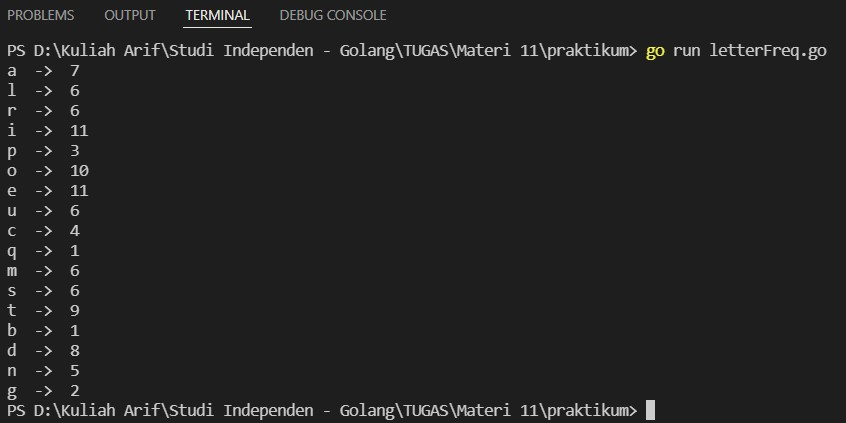

# (11) Concurrent Programing

## Resume
Dalam materi ini, yang dipelajari adalah :
1. Concurrent with Goroutines
2. Channel and Select
3. Race Condition

### Concurrent with Goroutines
sebelum itu kita harus mengenal perbedaan dari sequential program, parallel program, dan concurrent program :
- Sequential Program : sebelum task baru mulai, task sebelumnya harus selesai terlebih dahulu.
- Parallel Program : banyak tugas dapat dieksekusi secara bersamaan.
- Concurrent Program : banyak tugas dapat dieksekusi secara mandiri dan muncul secara bersamaan.

Goroutines adalah method atau fungsi yang dapat berjalan secara concurrent dengan method atau fungsi lain. biaya pembuatan goroutines lebih kecil dari thread. thread adalah process yang ringan, dengan kata lain thread adalah sebuah unit yang mengeksekusi code dibawah program.

### Channel and Select
Channel adalah object komunikasi yang mana goroutines menggunakan channel untuk dapat berkomunikasi dengan yang lain, channel ada 2 yaitu unbuffered channel dan buffered channel. Select sendiri berguna untuk memudahkan control komunikasi data melalui satu atau banyak channel.

### Race Condition
Race condition adalah keadaan dimana 2 thread mengakses memory secara bersamaan, salah satunya writing. race condition terjadi karena unsynchronized access ke shared memory. untuk mengatasi race condition bisa menggunakan wait groups, channel blocking, atau mutex.

## Task
### 1. Letter Frequency
pada task ini, hitung frekuensi huruf dalam teks menggunakan perhitungan bersamaan.
>Input: Lorem ipsum dolor sit amet, consectetur adipiscing elit, sed do eiusmod tempor incididunt ut labore et dolore magna aliqua.

Berikut kode dari task ini :

[letterFreq.go](./praktikum/letterFreq.go)

Hasil kode program :

