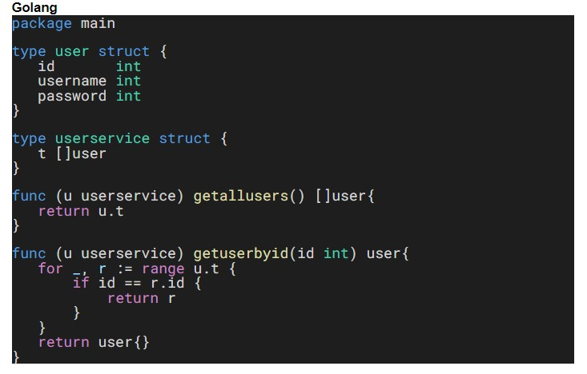
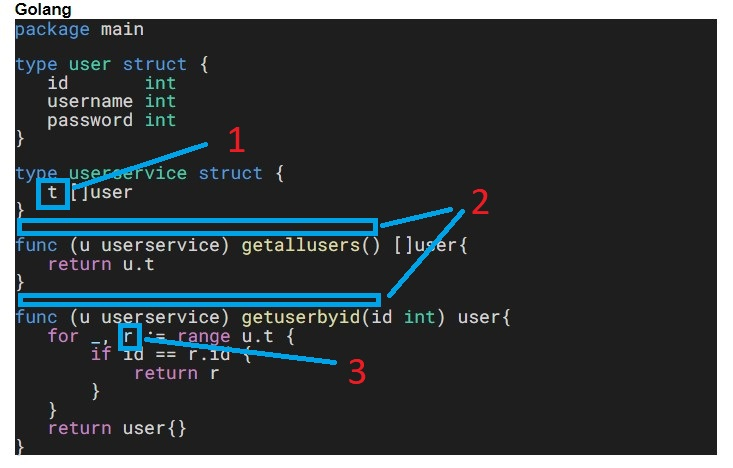
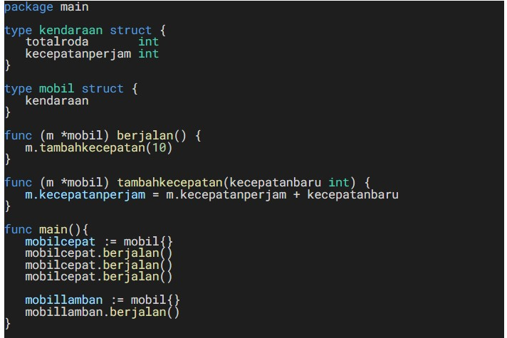
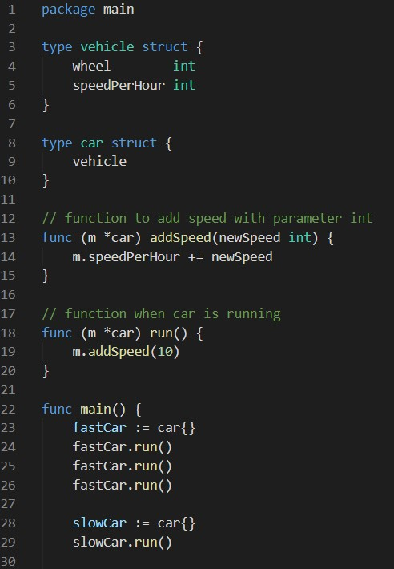

# (12) Clean Code

## Resume
Dalam materi ini, yang dipelajari adalah :
1. Clean Code
2. Karakteristik Clean Code
3. Prinsip Clean Code

### Clean Code
Clean code adalah istilah untuk kode yang mudah dibaca, dipahami, dan diubah oleh programmer. clean code sangat penting karena nantinya untuk mempermudah kita dalam work collaboration dalam tim, feature development dan faster development karena kode program mudah dibaca dan dipahami oleh orang lain.

### Karakteristik Clean Code
Clean code memiliki berbagai karakteristik, antara lain :
- Mudah dipahami.
- Mudah dieja dan dicari.
- Singkat namun mendeskripsikan konteks.
- Konsisten dalam penulisan function atau variabel ingin camel case, huruf kecil, dan lain - lain.
- Hindari penambahan konteks yang tidak perlu.
- Penambahan komentar tidak terlalu banyak, cukup 1 blok kode.
- Good function.
- Gunakan konvensi dengan melihat contoh penulisan kode dari perusahaan besar.
- Formatting seperti jarak baris, indentation, dan lain - lain.

### Prinsip Clean Code
Prinsip dari clean code adalah :
- Keep it so simple (KISS) dimana hindari membuat fungsi yang dibuat untuk melakukan A, sekaligus memodifikasi B, mengecek fungsi C, dan seterusnya.
- Don't Repeat Yourself (DRY) dimana duplikasi kode sering terjadi karena sering copy paste, untuk menghindari duplikasi code buatlah fungsi yang dapat digunakan secara berulang-ulang.

refactoring adalah proses restrukturisasi kode yang dibuat, dengan cara mengubah struktur internal tanpa mengubah perilaku eksternal. prinsip KISS dan DRY dapat dicapai dengan cara refactor.

## Task
### 1. Analysis
Kode berikut ini dituliskan tanpa mengikuti kebiasaan-kebiasaan penulisan yang disarankan.  
Berapa banyak kekurangan dalam penulisan kode tersebut?  
Bagian mana saja terjadi kekurangan tersebut?  
Tuliskan alasan dari tiap kekurangan tersebut!

Jawab :

[analyse.txt](./praktikum/analyse.txt)

- Berapa banyak kekurangan dalam penulisan kode tersebut?  
  
  **3**

- bagian mana saja terjadi kekurangan tersebut dan tuliskan alasannya!

    

  - Pada Nomer 1 variabel struct t tidak jelas penamaannya, jika itu merupakan array dari struct user maka nama variabel bisa diubah menjadi "list" atau yang lain.
  - Pada nomer 2 tidak ada komentar kegunaan fungsi tersebut.
  - Pada nomer 3 bisa diubah r menjadi v atau value karena for range tersebut untuk mengambil value array of struct.

### 2. Rewrite
Kode berikut ini dituliskan tanpa mengikuti kebiasaan-kebiasaan penulisan yang disarankan. Ubahlah penulisan kode berikut menjadi lebih terbaca dan rapi!

Berikut kode dari task ini :

[rewrite.go](./praktikum/rewrite.go)

Hasil kode program :

