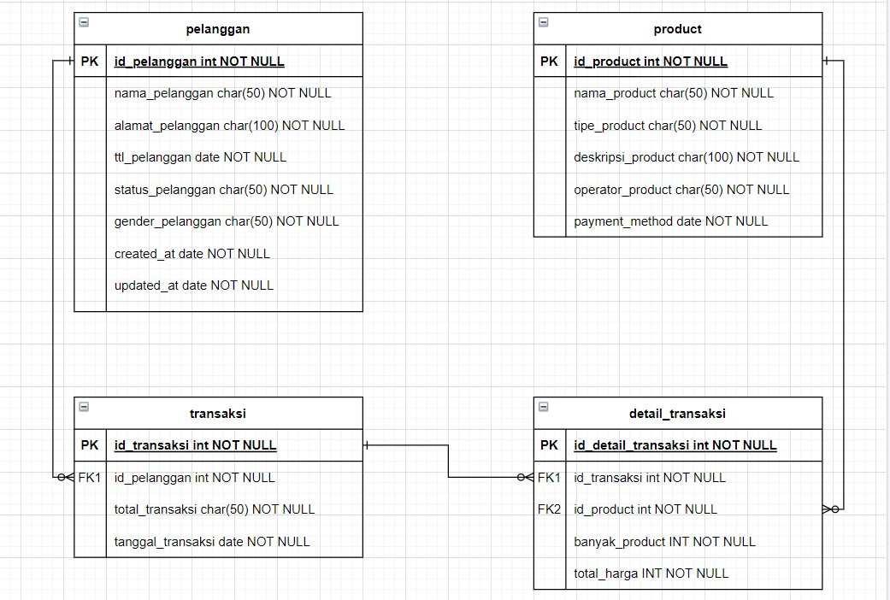
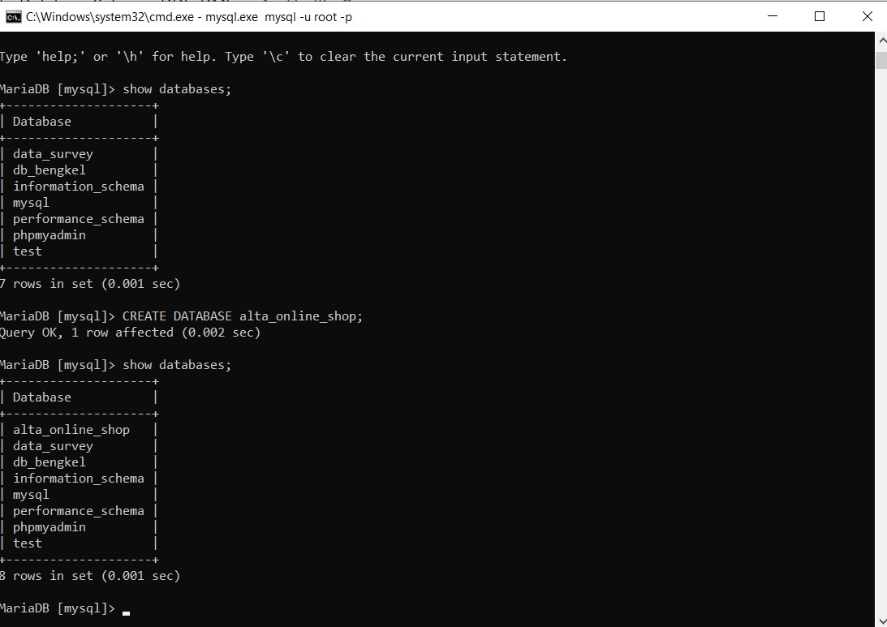
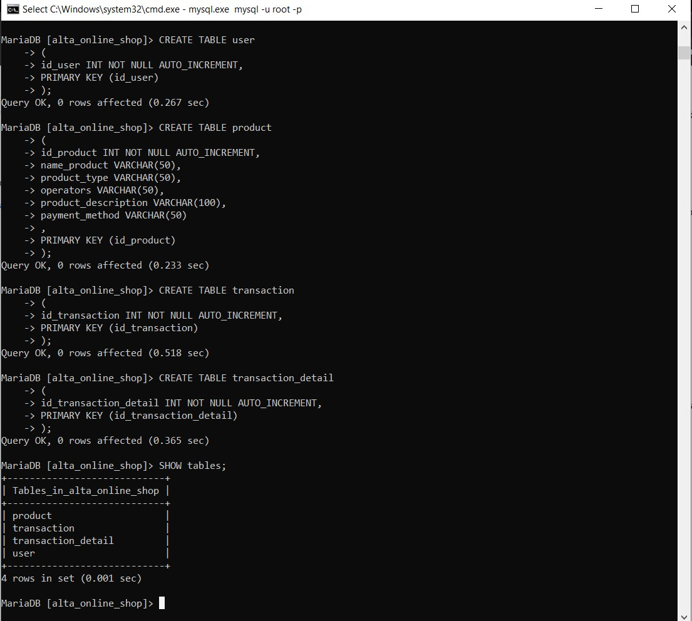
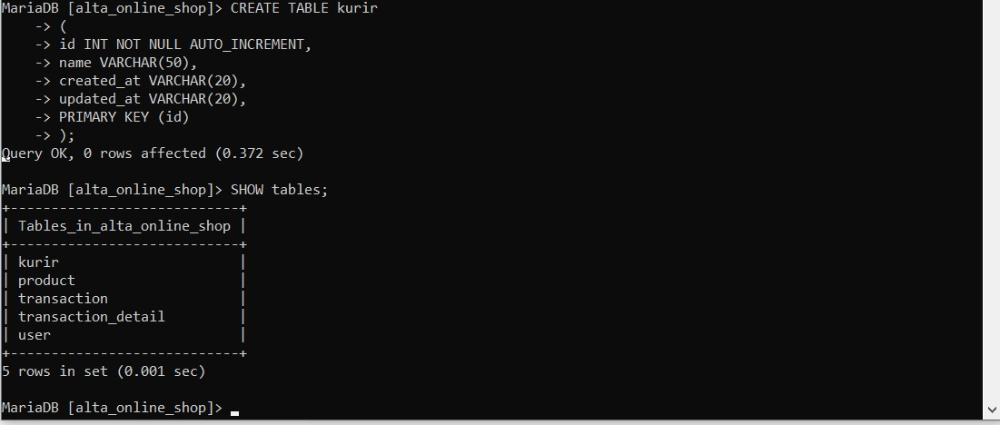
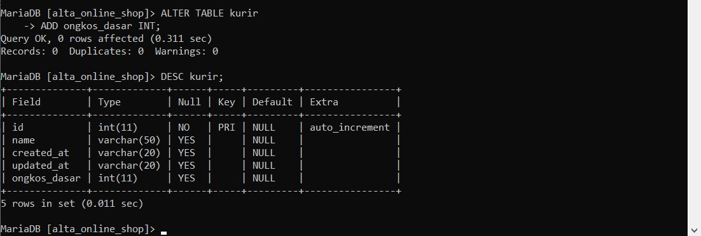
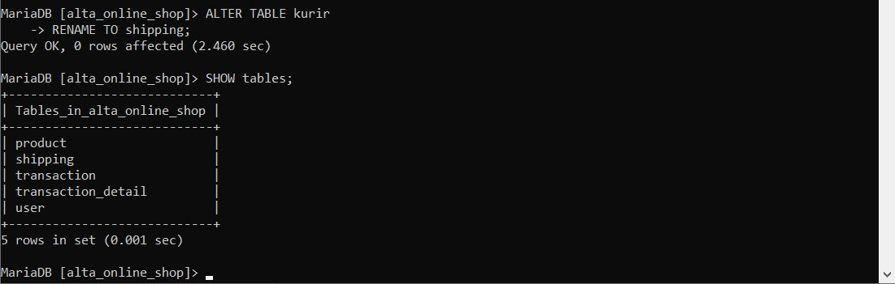
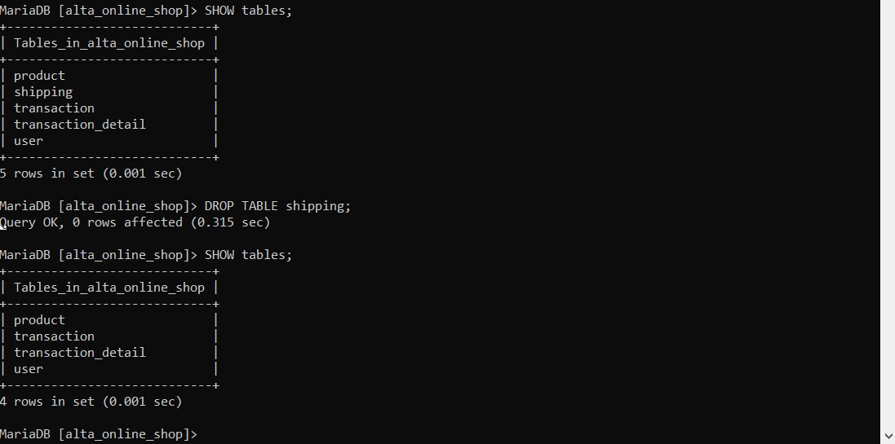
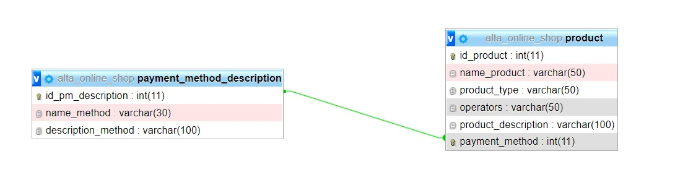
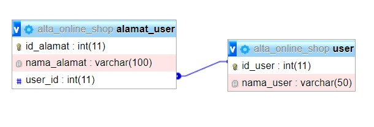

# (13) Database - DDL - DML

## Resume
Dalam materi ini, yang dipelajari adalah :
1. Database
2. Relationship Database
3. DDL and DML

### Database
Database adalah sekumpulan data yang terorganisir. database menyimpan banyak informasi data pada sistem, untuk dapat mengetahui mana yang disimpan di database bisa melihat model data yang ditampilkan.

### Relationship Database
Relationship database pada dasarnya ada 3 macam yaitu one-to-one, one-to-many, dan many-to-many. untuk menggambarkan relationship pada database bisa membuat Entity Relationship Diagram (ERD). untuk implementasi dari relationship database bisa menggunakan Relational Database Management System (RDBMS) contohnya adalah MySQL.

### DDL and DML
Pada dasarnya perintah sql ada 3 yaitu Data Definition Language (DDL), Data Manipulation Language (DML), dan Data Control Language (DCL). DDL adalah merupakan perintah yang dapat dimanfaatkan untuk membuat maupun memodifikasi struktur dari suatu objek dalam database yang utamanya berbentuk skema. contoh perintah dari DDL adalah Create Database, Create Table, Drop Table, dan lain - lain. DML sendiri adalah perintah yang digunakan untuk memanipulasi data dalam tabel pada suatu database. Contoh perintah dari DML adalah select, insert, update, delete, dan lain - lain

## Task
### 1. Schema Database
pada task ini kita implementasi pembuatan schema :
1. Sistem dapat menyimpan data mengenai detail item product, yaitu : product, product_type, product_description, operator, payment_methods
2. Sistem juga harus menyimpan data mengenai pelanggan yang akan membeli product tsb diantaranya : nama, alamat, tanggal lahir, status_user, gender, created_at, updated_at
3. Sistem dapat mencatat transaksi pembelian dari pelanggan.
4. Sistem dapat mencatat detail transaksi pembelian dari pelanggan.
5. Gunakan draw.io atau lucidchart untuk membuat ERD.

**Jawab :**

[erd.drawio](./praktikum/erd.drawio)

### 2. Data Definition Language
pada task ini kita menerapkan SQL di command line :

[alta_online_shop.sql](./praktikum/alta_online_shop.sql)

1. Create database alta_online_shop.

    
2. Dari schema Olshop yang telah kamu kerjakan di, Implementasikanlah menjadi table pada MySQL.
   - Create table user
   - Create table product, product type, operators, product description, payment_method.
   - Create table transaction, transaction detail.

    
3. Create tabel kurir dengan field id, name, created_at, updated_at.

    
4. Tambahkan ongkos_dasar column di tabel kurir.

    
5. Rename tabel kurir menjadi shipping.

    
6. Hapus / Drop tabel shipping karena ternyata tidak dibutuhkan.

    
7. Silahkan menambahkan entity baru dengan relation 1-to-1, 1-to-many, many-to-many. Seperti:
   - 1-to-1: payment method description.
   
   
   - 1-to-many: user dengan alamat.
   
   
   - many-to-many: user dengan payment method menjadi user_payment_method_detail.
   
   