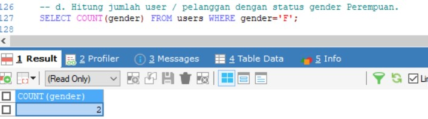

# (14) Join - Union - Agregasi - Subquery - Function (DBMS)

## Resume
Dalam materi ini, yang dipelajari adalah :
1. Join and Union
2. Agregasi and Subquery
3. Function

### Join and Union
Join adalah klausa untuk mengkombinasikan record dari dua atau lebih tabel. Join standar SQL ansi ada 3 yaitu 
1. Inner Join : mengembalikan baris - baris dari dua tabel atau lebih yang memenuhi syarat.
2. Left Join : mengembalikan seluruh baris dari tabel yang disebelah kiri yang dikenai kondisi ON dan hanya baris disebelah kanan saja yang memenuhi kondisi join.
3. Right Join : mengembalikan seluruh baris dari tabel yang disebelah kanan yang dikenai kondisi ON dan hanya baris disebelah kiri saja yang memenuhi kondisi join.

Union adalah digunakan untuk menggabungkan hasil-set dari dua atau lebih SELECT pernyataan. Perhatikan bahwa setiap pernyataan SELECT dalam UNION harus memiliki jumlah kolom yang sama. Kolom juga harus memiliki tipe data yang sama.

### Agregasi and Subquery
Agregasi adalah fungsi dimana nilai beberapa baris dikelompokkan bersama untuk membentuk nilai ringkasan tunggal, ada beberapa agregasi di SQL seperti
- Min : menentukan nilai terkecil dari sebuah data record pada tabel.
- Max : menentukan nilai terbesar dari sebuah data record pada tabel.
- Sum : menjumlahkan seluruh nilai dari sebuah data record pada tabel.
- Avg : mendapatkan nilai rata - rata dari sebuah data record pada tabel.
- Count : menghitung banyak data dari sebuah data record pada tabel.
- Having : menyeleksi data berdasarkan kriteria tertentu.

Subquery atau inner query atau nested query adalah query di dalam query SQL lain. Sebuah subquery digunakan dalam query utama sebagai syarat untuk lebih membatasi data yang akan diambil. subquery dapat digunakan pada SELECT, INSERT, UPDATE, DELETE bersama dengan operator seperti =, >, <, dan lain - lain.

### Function
Function adalah sebuah kumpulan statement yang akan mengembalikan sebuah nilai balik pada pemanggilnya. ada function biasa yang mengembalikan nilai dan ada juga function trigger yang biasanya digunakan untuk kumpulan kode SQL yang berjalan secara otomatis untuk mengeksekusi perintah INSERT, UPDATE, DELETE.

## Task
### 1. Data Manipulation Language
pada task ini kita membuat query data manipulation language dengan perintah seperti berikut :

[File Query SQL Data Manipulation Language](./praktikum/1.sql)

1. Insert
   - Insert 5 operators pada table operators.
     

   - Insert 3 product type.
    

   - Insert 2 product dengan product type id = 1, dan operators id = 3.

   

   - Insert 3 product dengan product type id = 2, dan operators id = 1.

   

   - Insert 3 product dengan product type id = 3, dan operators id = 4.

   

   - Insert product description pada setiap product.

   

   - Insert 3 payment methods.

   

   - Insert 5 user pada tabel user.

   

   - Insert 3 transaksi di masing-masing user.

   

   - Insert 3 product di masing-masing transaksi.

   

2. Select
   - Tampilkan nama user / pelanggan dengan gender Laki-laki / M.

   

   - Tampilkan product dengan id = 3.

   

   - Tampilkan data pelanggan yang created_at dalam range 7 hari kebelakang dan mempunyai nama mengandung kata ‘a’.

   

   - Hitung jumlah user / pelanggan dengan status gender Perempuan.

   

   - Tampilkan data pelanggan dengan urutan sesuai nama abjad

   

   - Tampilkan 5 data pada data product

   

3. Update
   - Ubah data product id 1 dengan nama ‘product dummy’.

   

   - Update qty = 3 pada transaction detail dengan product id 1.

   

4. Delete
   - Delete data pada tabel product dengan id 1.

   

   - Delete pada pada tabel product dengan product type id 1.

   

### 2. Join, Union, Sub-query, Function
pada task ini kita membuat query untuk Join, Union, Sub-query, Function dengan perintah seperti berikut :

[File Query SQL Join, Union, Sub-query, Function](./praktikum/2.sql)

1. Gabungkan data transaksi dari user id 1 dan user id 2.

2. Tampilkan jumlah harga transaksi user id 1.

3. Tampilkan total transaksi dengan product type 2.

4. Tampilkan semua field table product dan field name table product type yang saling berhubungan.

5. Tampilkan semua field table transaction, field name table product dan field name table user.

6. Buat function setelah data transaksi dihapus maka transaction detail terhapus juga dengan transaction id yang dimaksud.

7. Buat function setelah data transaksi detail dihapus maka data total_qty terupdate berdasarkan qty data transaction id yang dihapus.

8. Tampilkan data products yang tidak pernah ada di tabel transaction_details dengan sub-query.

