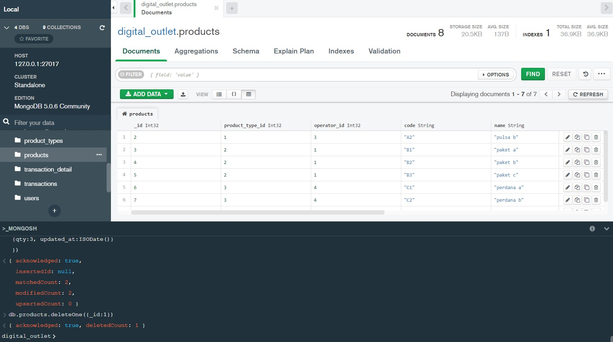

# (15) Introduction NoSQL and MongoDB

## Resume
Dalam materi ini, yang dipelajari adalah :
1. NoSQL
2. Tipe / Kategori NoSQL
3. Basic MongoDB

### NoSQL
NoSQL atau Not SQL adalah cara berpikir baru tentang database dimana NoSQL itu bukan relational database. NoSQL merupakan DBMS yang menyediakan mekanisme yang lebih fleksibel dibandingkan dengan model RDBMS dengan
- menghindari effort pada sifat ACID di RDBMS
- menghindari kompleksitas SQL
- menghindari design schema di depan
- menghindari transaction (ditangani oleh aplikasi)

kelebihan dari NoSQL adalah schema less, fast development, support big size file, support cluster. NoSQL digunakan saat membutuhkan schema yang fleksibel, ACID tidak diperlukan, terdistribusi, data logging, dan data sementara.

### Tipe / Kategori NoSQL
NoSQL ada beberapa tipe atau kategori, antara lain 
- Key / value : Tipe yang simpel dimana isinya memiliki key dan value dimana key tersebut bersifat unik dan diakses menggunakan key. Contoh database nya adalah Redis.
- Column - Family : Penyimpanan data per kolom, memiliki kelebihan untuk pencarian data yang kompleks. contoh database nya adalah Cassandra.
- Graph : Memodelkan struktur relasi dari data dengan konsep nodes, edges, dan property. contoh database nya adalah neo4j
- Document - Based : menyimpan informasi sebagai dokumen. contoh database nya adalah mongoDB
- Other geospatial File-system Object.

### Basic MongoDb
pada mongoDB, collection mungkin sama dengan table pada SQL yang isinya merupakan data yang serupa. mongoDB memiliki berbagai perintah basic seperti
- use ... : untuk menggunakan database
- db.createCollection('...') : untuk membuat collection
- db.collectionName.Insert(...) : untuk memasukkan data ke collection
- db.collectionName.find() : untuk menampilkan isi data yang ada pada collection
- db.collectionName.update(...) : untuk mengupdate atau mengubah data
- db.collectionName.delete(...) : untuk menghapus data

## Task
### 1. Create, Read, Update and Delete
pada task ini kita melakukan praktek penggunaan MongoDB dengan perintah seperti berikut :

[File Daftar Query MongoDB](./praktikum/query_mongoDB.js)

1. Insert
   - Insert 5 operators pada table operators.
     

   - Insert 3 product type.
     

   - Insert 2 product dengan product type id = 1, dan operators id = 3.
     

   - Insert 3 product dengan product type id = 2, dan operators id = 1.
     

   - Insert 3 product dengan product type id = 3, dan operators id = 4.
     

   - Insert product description pada setiap product.
     

   - Insert 3 payment methods.
     

   - Insert 5 user pada tabel user.
     

   - Insert 3 transaksi di masing-masing user.
     

   - Insert 3 product di masing-masing transaksi.
     

2. Select
   - Tampilkan nama user / pelanggan dengan gender Laki-laki / M.
     

   - Tampilkan product dengan id = 3.
     

   - Hitung jumlah user / pelanggan dengan status gender Perempuan.
     

   - Tampilkan data pelanggan dengan urutan sesuai nama abjad
     

   - Tampilkan 5 data pada data product
     

3. Update
   - Ubah data product id 1 dengan nama ‘product dummy’.
     

   - Update qty = 3 pada transaction detail dengan product id 1.
     

4. Delete
   - Delete data pada tabel product dengan id 1.
     

   - Delete pada pada tabel product dengan product type id 1.
     
