# (16) MongoDB : Advanced Query - Array - Aggregation

## Resume
Dalam materi ini, yang dipelajari adalah :
1. Advanced Query
2. Array
3. Aggregation

### Advanced Query
Pada mongoDB terdapat advanced query

### Array
yeet

### Aggregation
teey

## Task
### 1. Aggregation MongoDB
pada task ini kita membuat query aggregation pada MongoDB dengan perintah seperti berikut :

[File Daftar Query MongoDB](./praktikum/query.js)

1. Gabungkan (menampilkan) data buku dari author id 1 dan author id 2.
  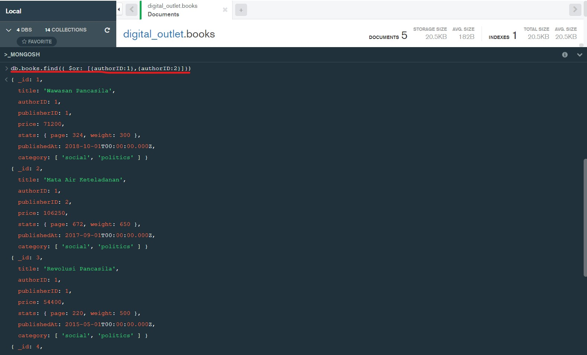

2. Tampilkan daftar buku dan harga author id 1.
  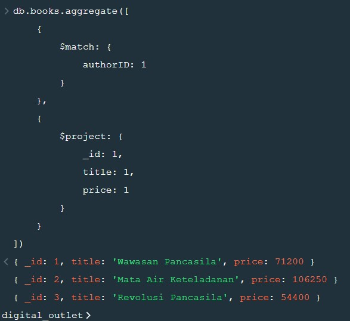

3. Tampilan total jumlah halaman buku author id 2.
  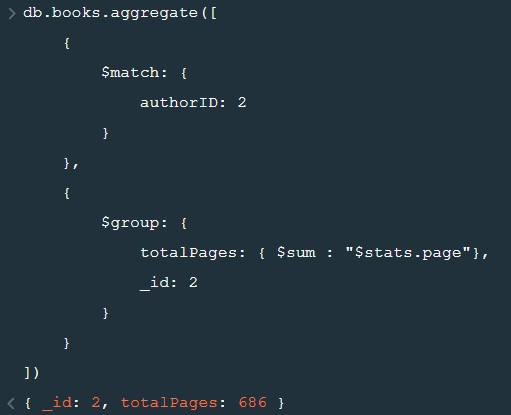

4. Tampilkan semua field books and authors terkait.
  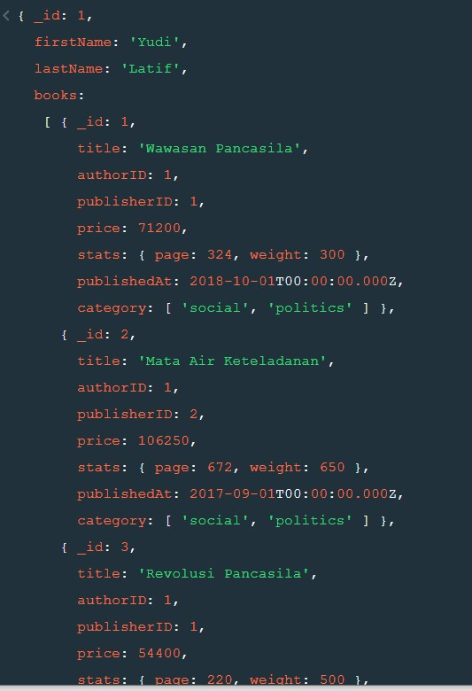
  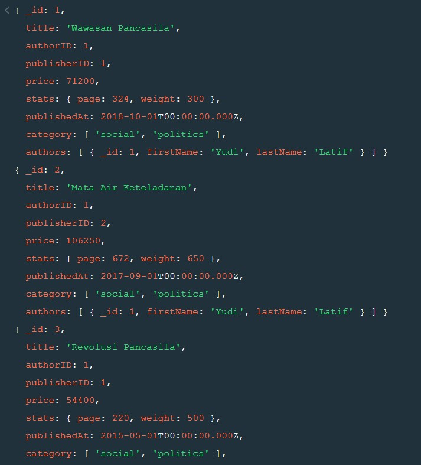

5. Tampilkan semua field books, authors, dan publishers terkait.
  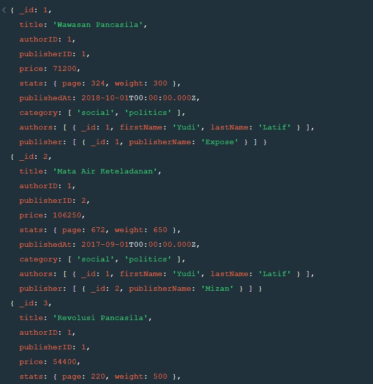

6. Tampilkan summary data authors, books, dan publishers sesuai dengan Output.
  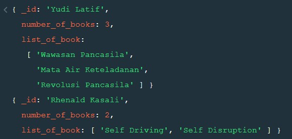

7. Digital_outlet ingin memberikan diskon untuk setiap buku, diskon di tentukan melihat harga buku tersebut dengan pembagian seperti ini.
  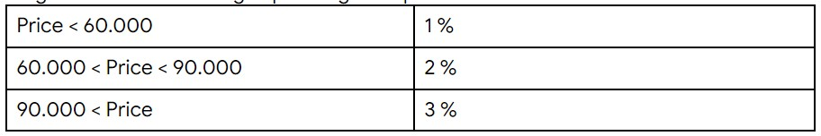
  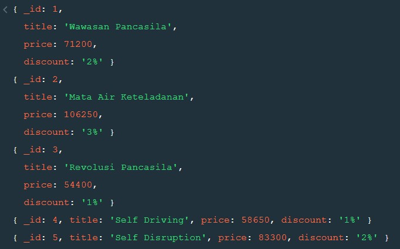

8. Tampilkan semua nama buku, harga, nama author dan nama publisher, urutkan dari harga termahal ke termurah.
  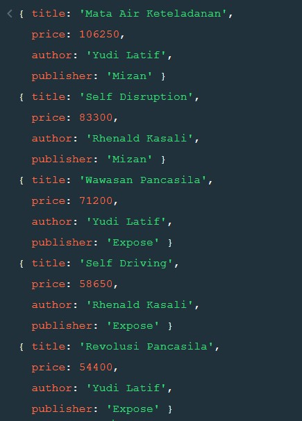

9. Tampilkan data nama buku harga dan publisher, kemudian tampilkan hanya data ke 3 dan ke 4.
  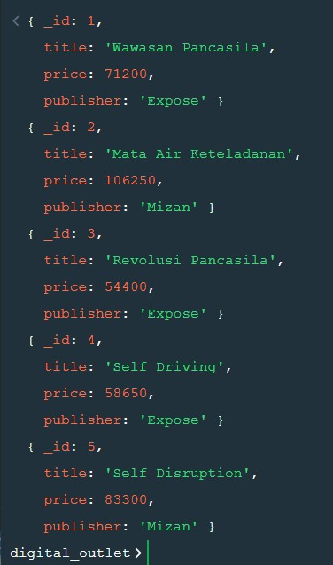
  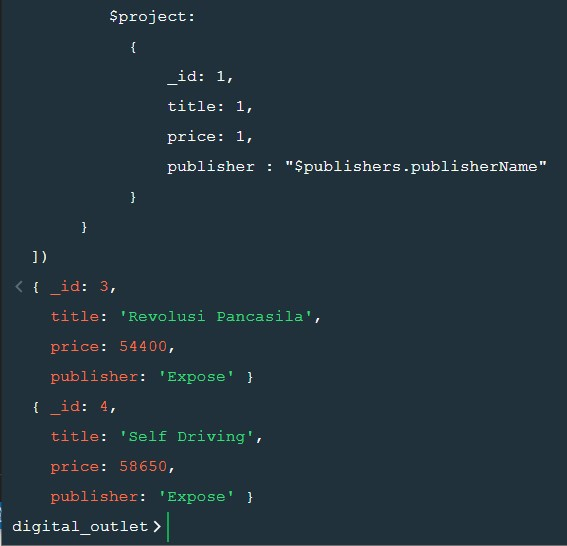