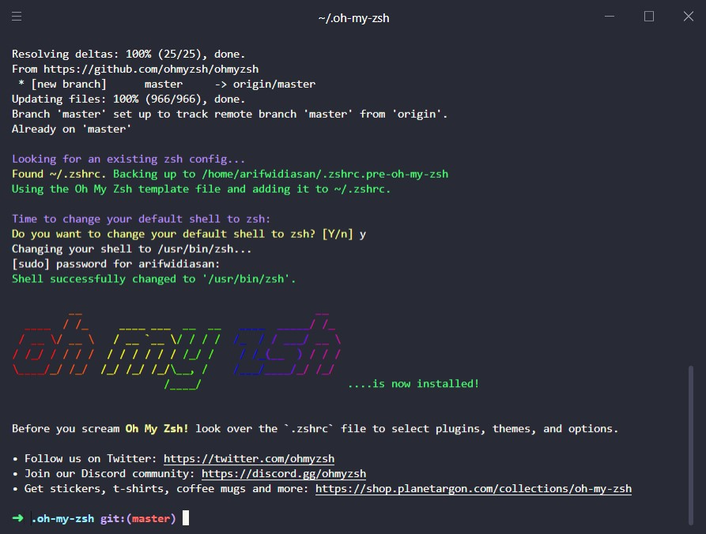
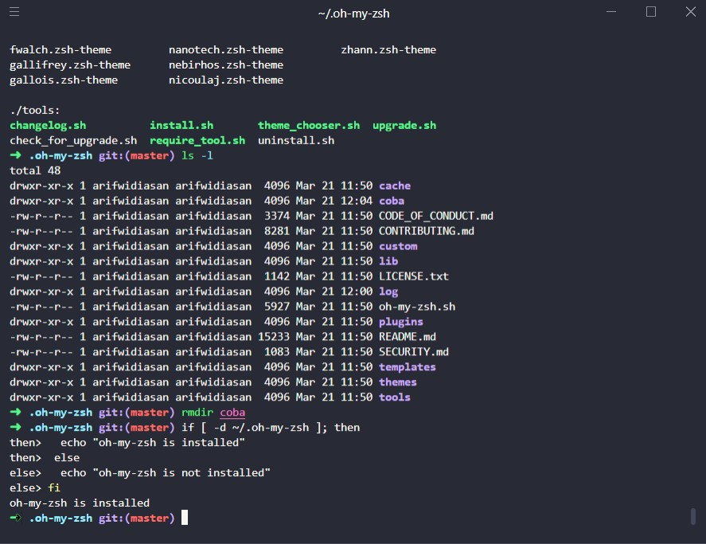
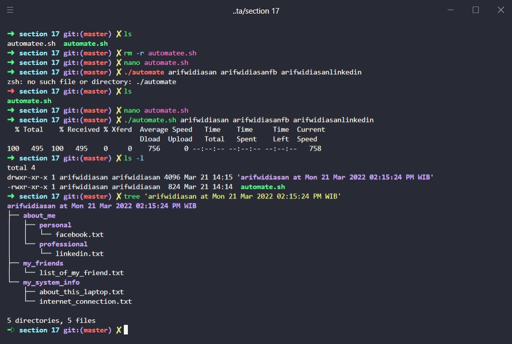
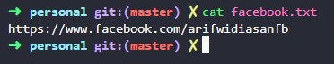
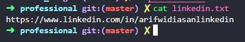
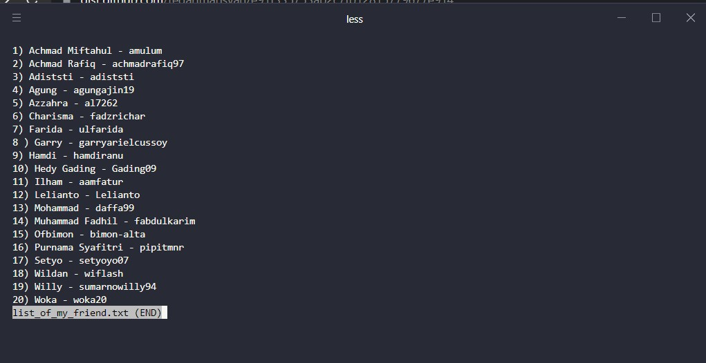
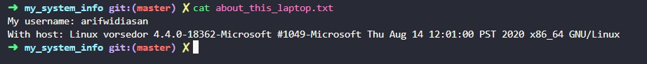
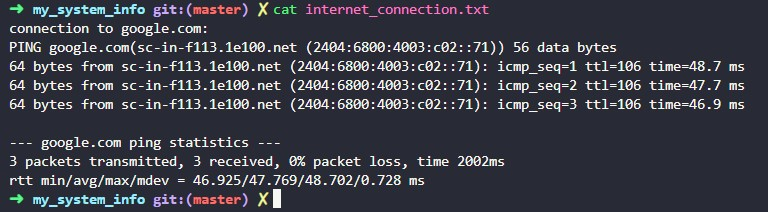

# (17) Configuration Management and CLI

## Resume
Dalam materi ini, yang dipelajari adalah :
1. What is Command Line
2. Why Use Command Line
3. UNIX Popular Command

### What is Command Line
Command line adalah text-based interface dan cepat yang digunakan developer secara efektif dan efisien dalam berkomunikasi dengan komputer untuk mencapai task yang lebih banyak. Command line berbeda dengan user interface dimana user interface lebih memudahkan kita untuk melakukan perintah karena sudah disediakan tampilan nya, namun command line memiliki perintah yang lebih banyak untuk menjalankan task.

### Why Use Command Line
Command line walaupun terkesan sulit digunakan namun memiliki banyak task yang bisa dilakukan dan manfaat nya antara lain :
- Granular control dari OS atau aplikasi.
- Cepat dalam management operating systems skala banyak.
- Kemampuan untuk menyimpan script untuk automate reguler tasks.
- interface nya dapat membantu dalam troubleshooting seperti isu koneksi internet.

### UNIX Command
UNIX Shell memiliki berbagai populer command yang dapat dikategorikan sebagai berikut
- Directory : untuk melakukan task yang berhubungan dengan folder seperti list folder (ls), membuat directory (mkdir), menghapus file (rm), dan masih banyak lagi.
- Files : untuk melakukan task yang berhubungan dengan file seperti membuat file (touch), melihat file (cat), edit file (nano), ubah permission (chown,chmod), dan lain - lain.
- Network : untuk melakukan task yang berhubungan dengan network seperti ping, ssh, netstat, dan lain - lain.
- utility : untuk utility ada berbagai macam seperti mencetak (echo), menampilkan tanggal sekarang (date), masuk ke super user (sudo), dan lain - lain.

## Task
### 1. Install oh-my-zsh
pada task ini, melakukan instalasi oh-my-zsh shell.





### 2. Create Automation Script
pada task ini, buat automation script dengan perintah sebagai berikut
1. script dipanggil dengan
```
./automate [nama] [namafb] [namalinkedin]
```
2. Struktur folder dapat dilihat dengan
```
▶ tree "[nama] at Wed Jul 3 18:50:22 WIB 2019"
[nama] at Wed Jul 3 18:50:22 WIB 2019
├── about_me
│   ├── personal
│   │   └── facebook.txt
│   └── professional
│       └── linkedin.txt
├── my_friends
│   └── list_of_my_friends.txt
└── my_system_info
    ├── about_this_laptop.txt
    └── internet_connection.txt
5 directories, 5 files
```
3. catatan :
   - Folder utama dengan nama **[nama] at Wed Jul 3 18:50:22 WIB 2019** merupakan gabungan dari **argumen pertama** dan command **date**
   - File facebook.txt dan linkedin.txt berisikan url dengan username masing masing di **argumen kedua** dan **ketiga**
   - File list_of_my_friends.txt berisikan daftar nama teman teman yang diambil menggunakan command curl dari file soal
   - File about_this_laptop.txt berisikan nama user dan **uname -a** dengan format di soal
   - File internet_connection.txt berisikan hasil keluaran ping ke google.com sebanyak 3 kali.

Berikut adalah pengerjaan dan hasil output dari task tersebut.

[automate.sh](./praktikum/automate.sh)

- Tree directory
<br><br>

- facebook.txt
<br><br>

- linkedin.txt
<br><br>

- list_of_my_friend.txt
<br><br>

- about_this_laptop.txt
<br><br>

- internet_connection.txt
<br><br>