# (19) Intro RESTful API

## Resume
Dalam materi ini, yang dipelajari adalah :
1. Application Programming Interface
2. REST API
3. Rest API Best Practice

### Application Programming Interface
Application Programming Interface (API) adalah suatu set fungsi dan prosedur yang memungkinkan untuk membuat aplikasi yang dapat mengakses fitur atau data dari sistem operasi, aplikasi, atau servis lainnya. API bekerja dengan cara client meminta data ke server melalui API lalu akan ada respon dari server yang akan dikirim ke client melalui API juga.

### Rest API
Representational State Transfer (Rest) adalah web-service untuk API yang menyimpan dan mengembalikan data yang diperlukan. REST API menggunakan HTTP protocol, contohnya seperti https://swapi.dev/api/. Request dan Respon format dapat berupa JSON, XML, dan SOAP. untuk HTTP request method yang paling umum ada GET, POST, PUT, dan Delete.

### Rest API Best Practice
Pada Rest API terdapat respon dari server seperti
- **200** OK
- **201** Created
- **400** Bad Request
- **401** Unauthorized
- **404** Not Found
- **405** Method not Allowed
- **500** Internal Server Error

Best practice pada Rest API saat menulis collection adalah gunakan kata benda daripada kata kerja karena lata kerja sudah ada pada HTTP request method, penamaan menggunakan kata jamak, dan gunakan resource nesting untuk menunjukkan hirarki data.

## Task
### 1. Create, Read, Update and Delete
Pada task ini, Buat satu collection, dan memanfaatkan fitur environment dan lakukan request terhadap api yang ada di API Documentation menggunakan Postman. Lakukan request terhadap 3 target api berikut!
1. https://newsapi.org/ , lakukan request API minimal 5 API
     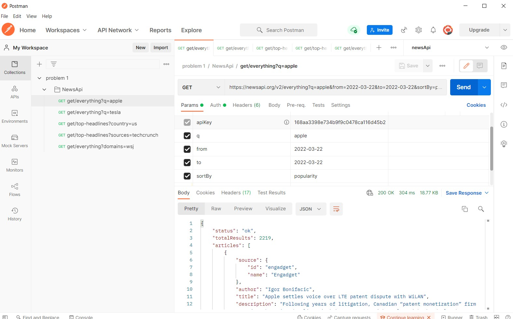
     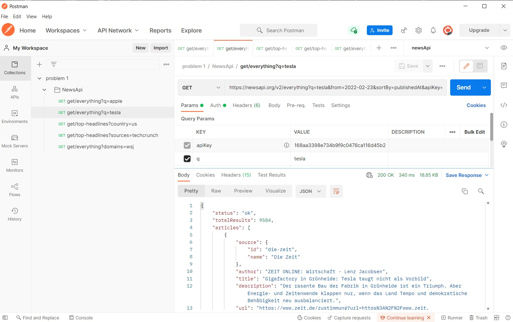
     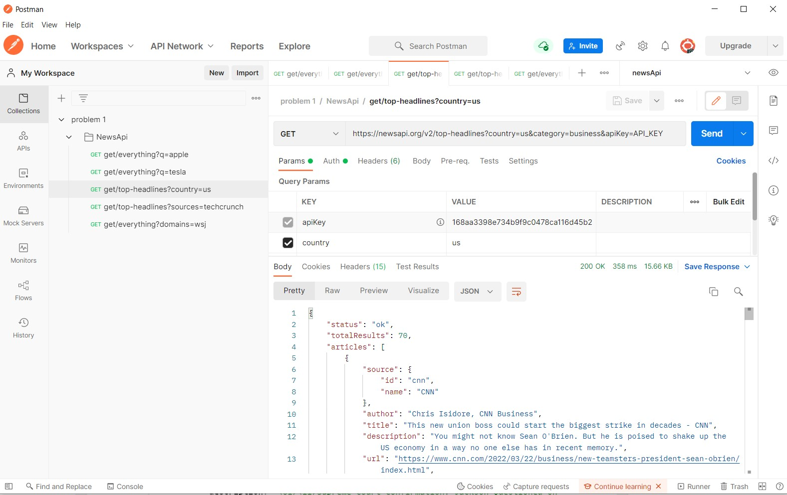
     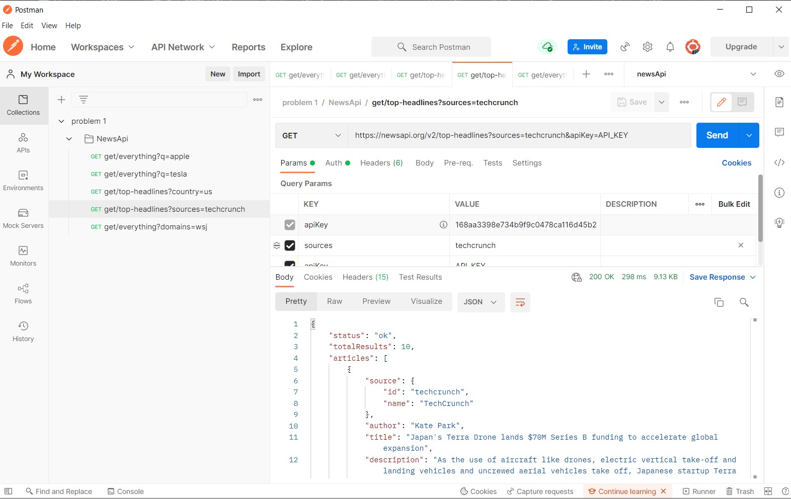
     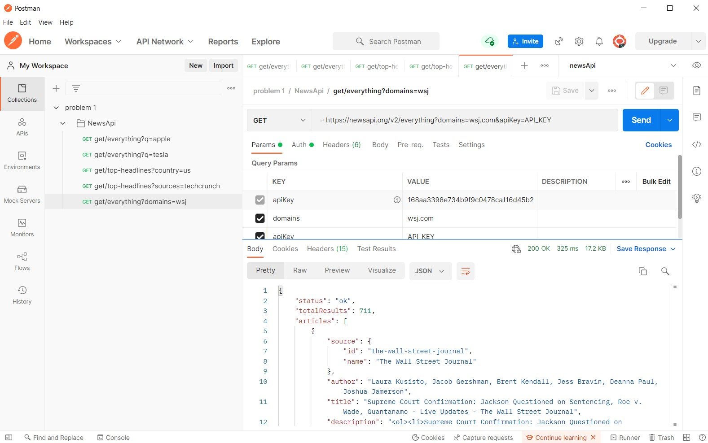

2. https://swapi.dev/ , lakukan request API minimal 5 API
     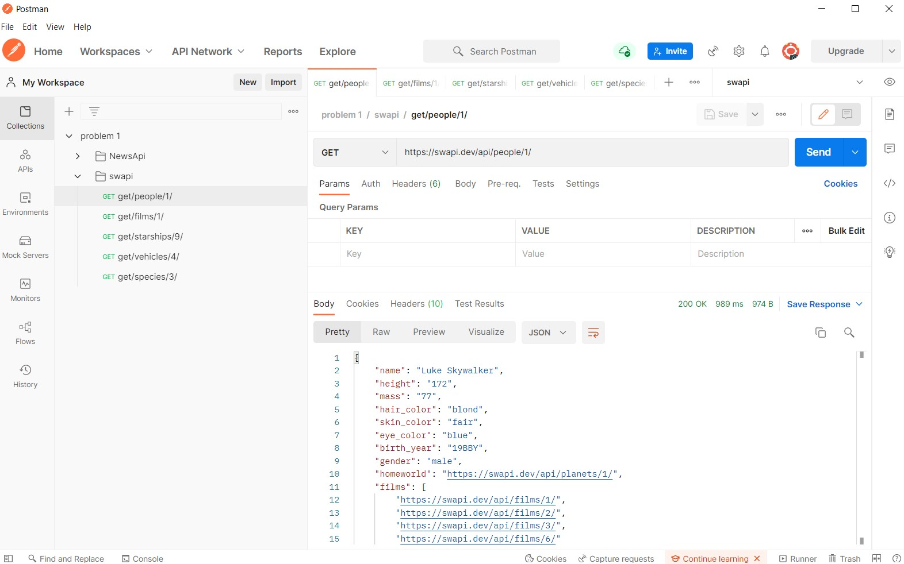
     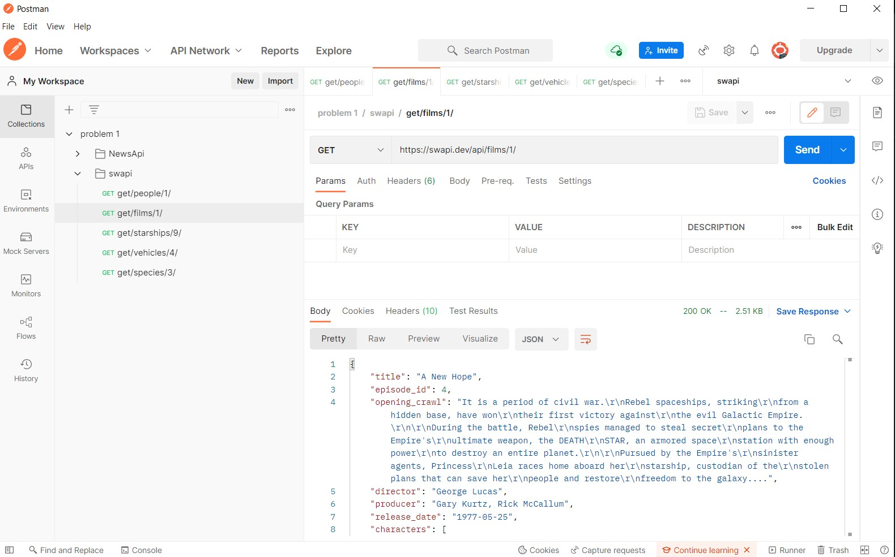
     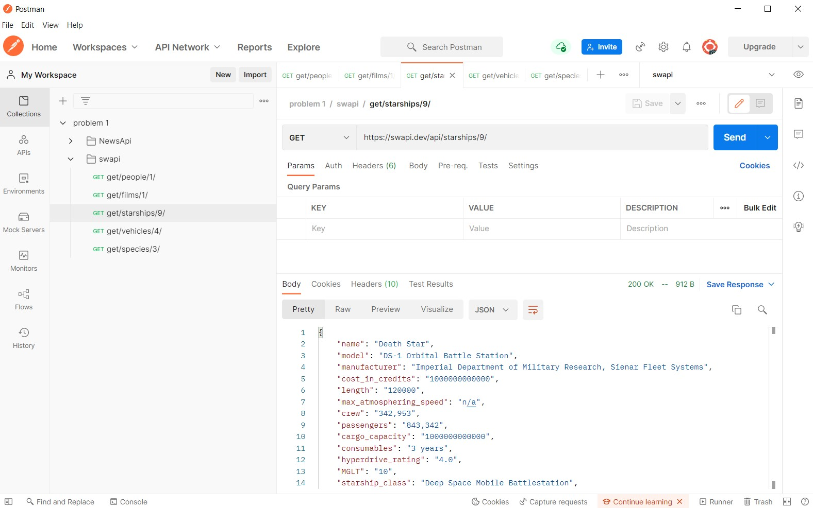
     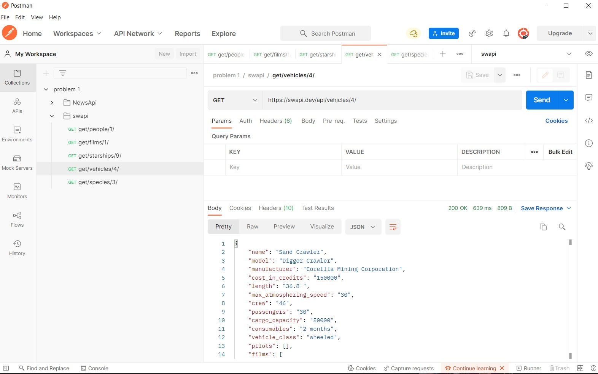
     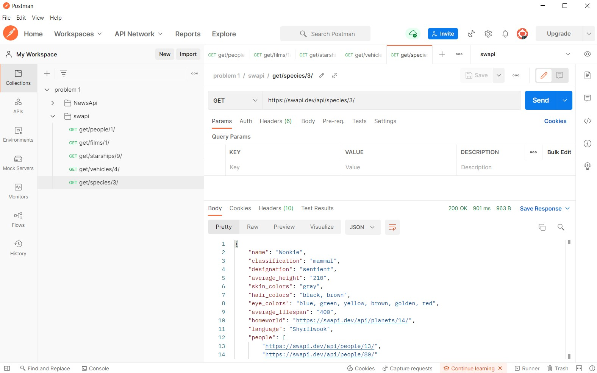

3. https://virtserver.swaggerhub.com/sepulsa/RentABook-API/1.0.0 , Lakukan request terhadap API dengan mengimplementasikan 4 Method GET, POST, PUT, DELETE.
   - GET
     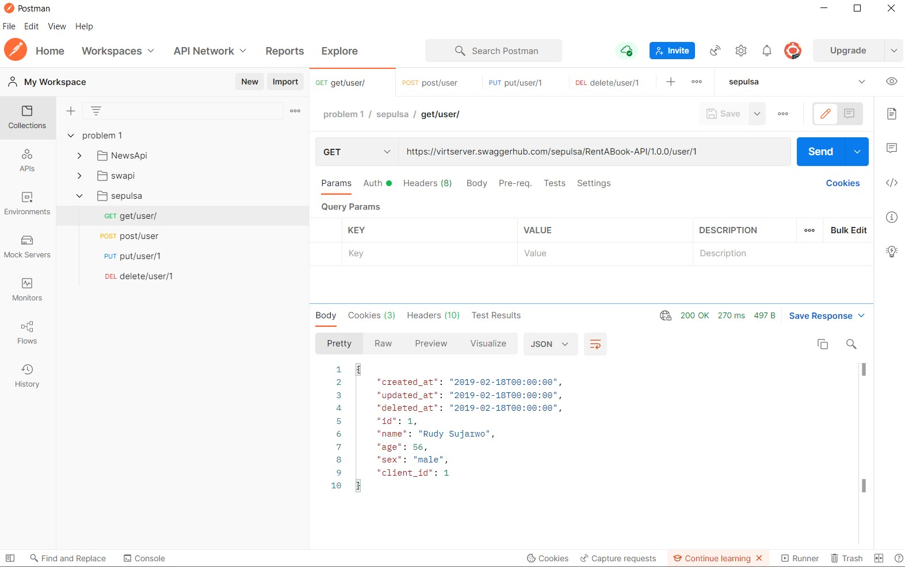

   - POST
     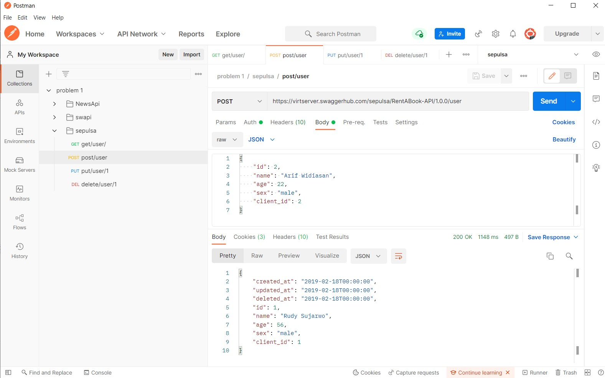

   - PUT
     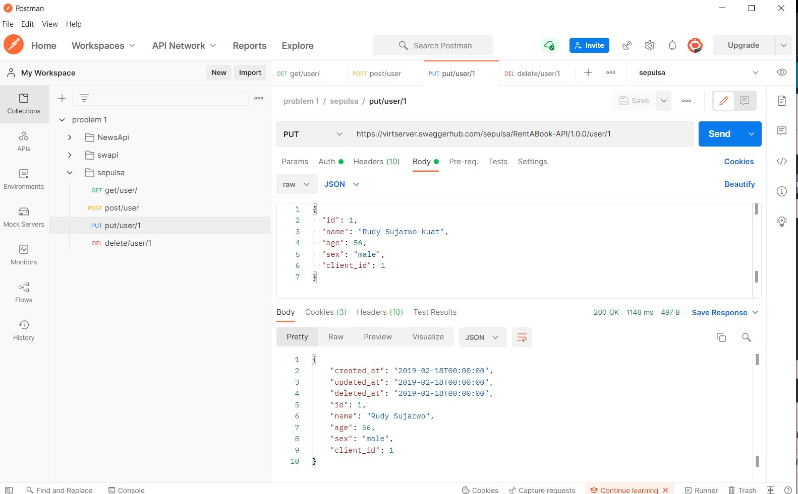

   - DELETE
     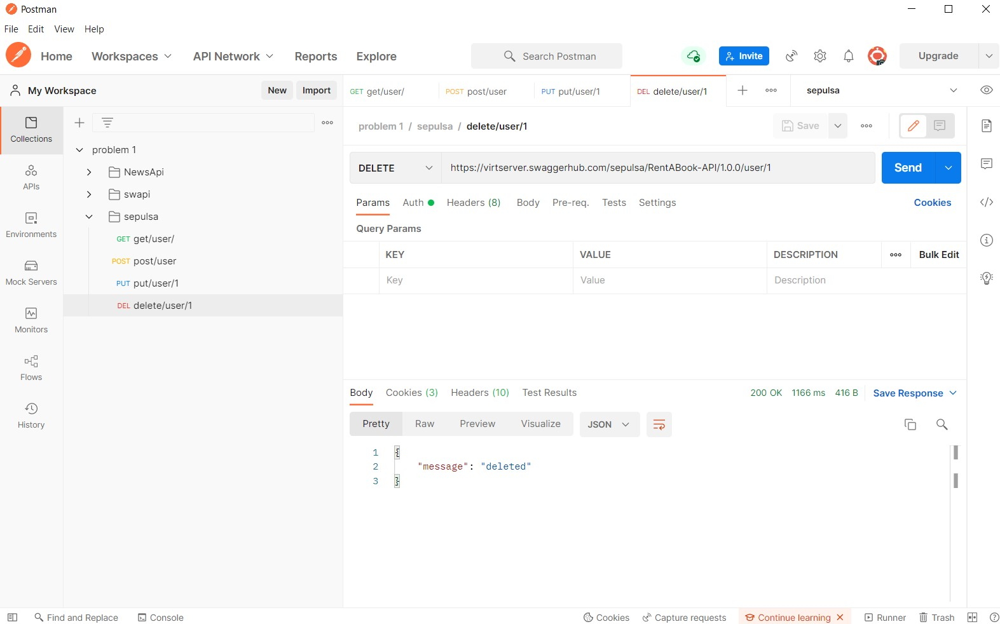