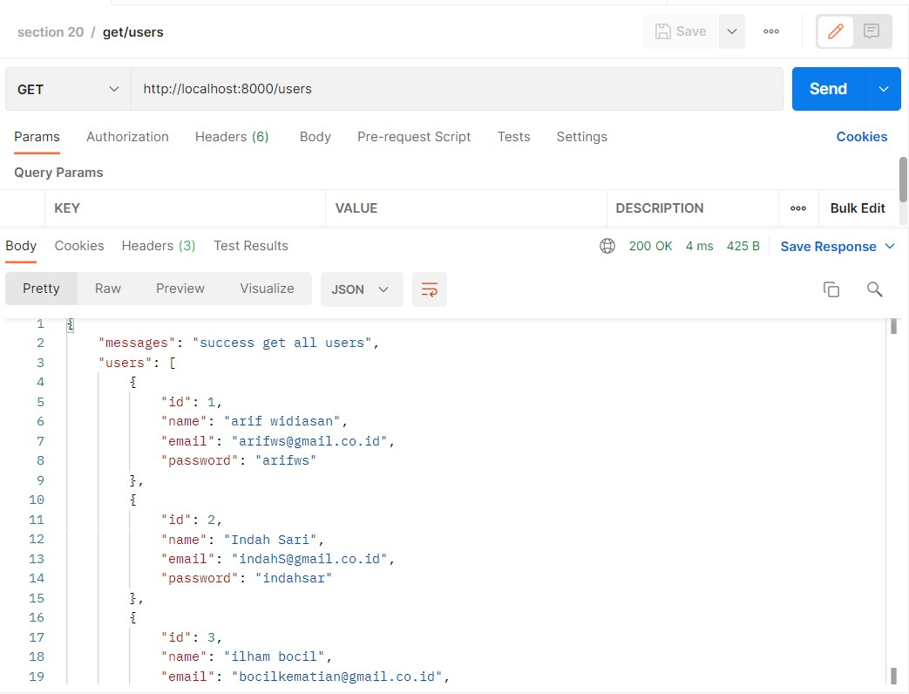
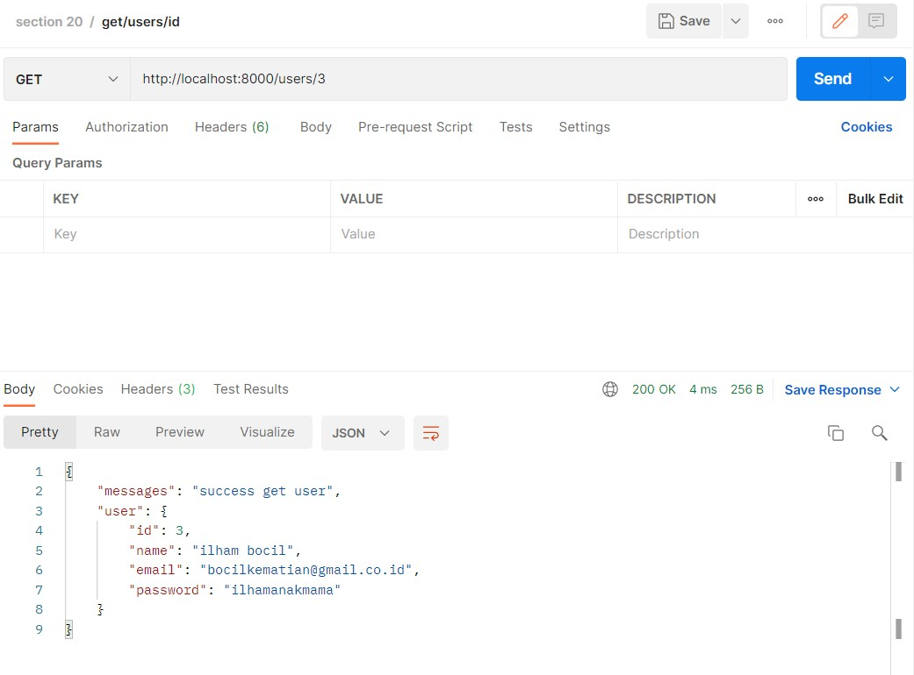
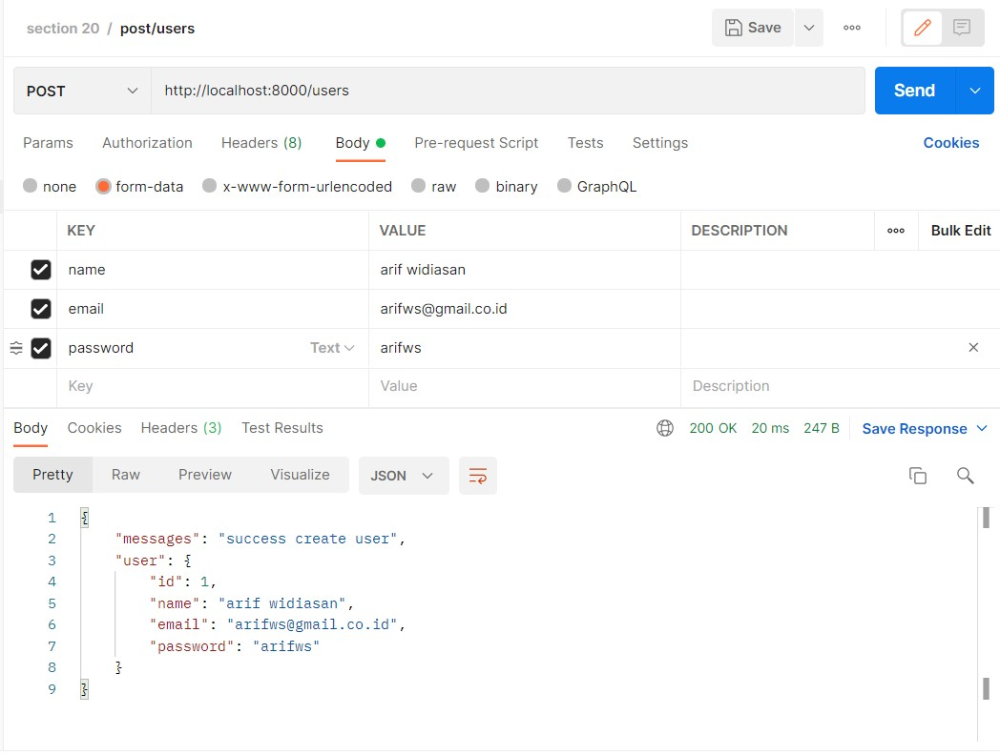
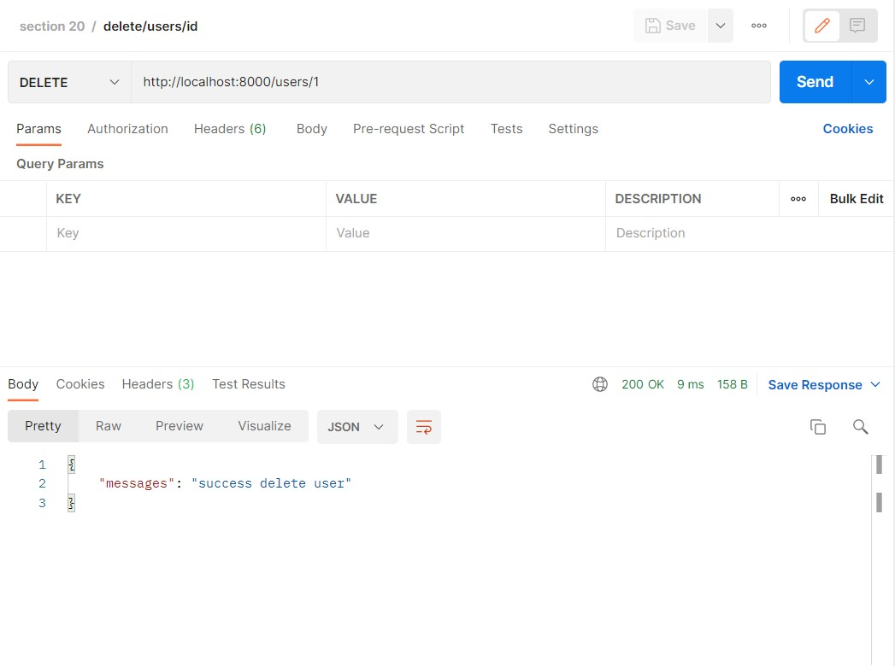
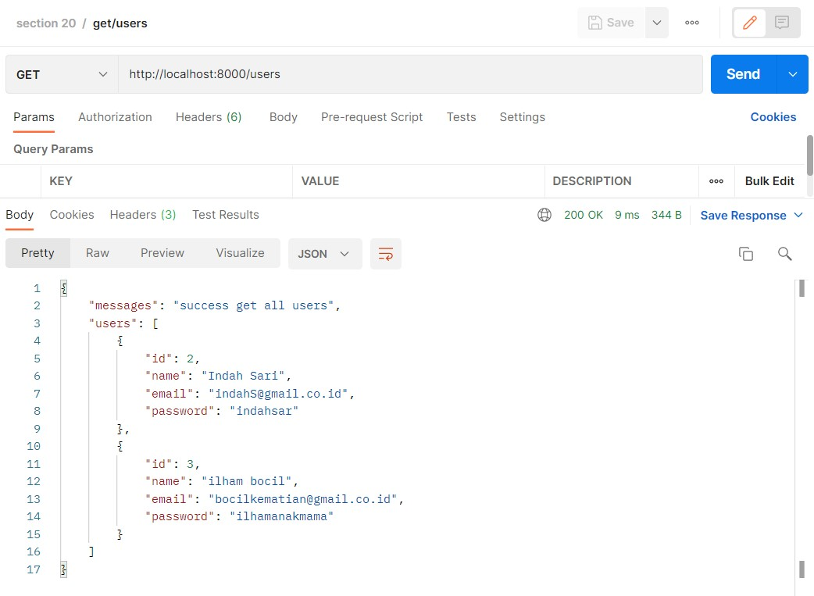
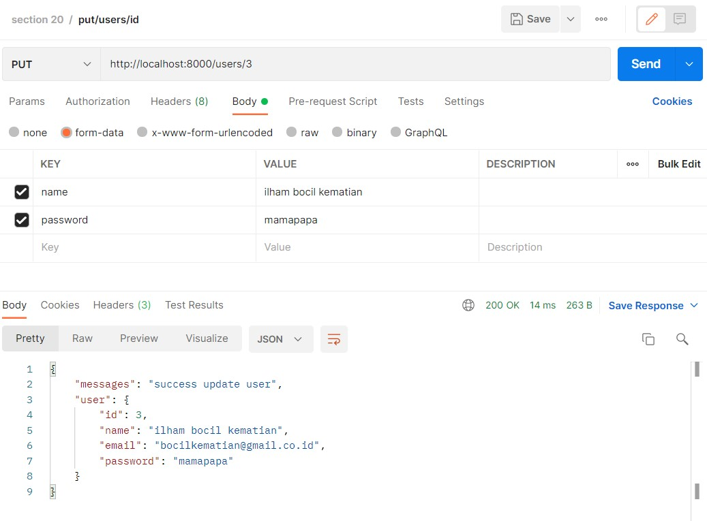

# (20) Intro Echo Golang

## Resume
Dalam materi ini, yang dipelajari adalah :
1. Echo Golang
2. Basic Routing & Controller
3. Data Rendering, Data Retrieve, dan Binding Data

### Echo Golang
Third party / library adalah kumpulan dari sebuah code yang memiliki fungsi - fungsi tertentu dan dimana fungsi itu dapat dipanggil oleh program lain. Echo sendiri adalah sebuah library dimana echo merupakan web framework golang yang memiliki performa tinggi, extensible dalam arti bisa dipasang dengan library lain seperti GORM, dan minimalist dalam arti cukup sederhana tidak memerlukan driver database atau ORM namun cukup powerful. Keuntungan dari echo adalah optimized router, middleware, data rendering, scaleable, dan data binding. Echo juga tidak memiliki struktur dalam pengembangannya.

### Basic Routing & Controller
Pada saat ingin menggunakan Echo Golang, pertama yang harus dilakukan adalah melakukan setup awal pada direktori project kita dengan melakukan inisialisasi awal dan mengambil library dari echo golang
```
go mod init <direktori>
go get github.com/labstack/echo/v4
```
Kemudian contoh kode program merupakan basic routing dan controller untuk mencetak **"hello world"**
```
package main

import (
	"net/http"
	
	"github.com/labstack/echo/v4"
)

func main() {
	e := echo.New()
	e.GET("/", func(c echo.Context) error {
		return c.String(http.StatusOK, "Hello, World!")
	})
	e.Logger.Fatal(e.Start(":1323"))
}
```

### Data Rendering, Data Retrieve, dan Binding Data
Data rendering merupakan bagaimana API dapat mengirim berbagai HTTP Response dalam JSON, XML, HTML, File, Attachment, Inline, Stream atau Blob. Data Retrieve adalah bagaimana kita mendapat data dengan spesifikasi tertentu, dalam hal ini kita bisa menggunakan URL Params, Query Params, atau Form Value. Binding data adalah untuk HTTP Request Payload.

## Task
### 1. Create Static API CRUD User
pada task ini, Buat Static API CRUD User dengan spesifikasi seperti berikut!

| Route | HTTP | Description |
| --- | --- | --- |
| `/users` | GET | Get all users data |
| `/users/:id` | GET | Get single user by id |
| `/users` | POST | Create new user |
| `/users/:id` | DELETE | Delete user by id |
| `/users/id` | PUT | Update user information |

Kode Program dan hasil output nya adalah :

[main.go](./praktikum/main.go)

1. Get all users data
   <br><br>

2. Get single user by id
   <br><br>

3. Create new user
   <br><br>

4. Delete user by id
   <br><br>
   <br><br>

5. Update user information
   <br><br>