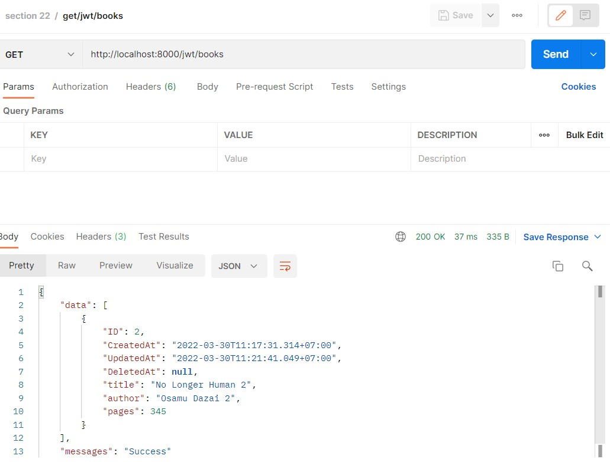

# (22) Middleware

## Resume
Dalam materi ini, yang dipelajari adalah :
1. Middleware
2. Log and Auth Middleware
3. JWT Middleware

### Middleware
Middlware adalah entitas yang terpasang pada proses server request/response, middleware memperbolehkan kita untuk implementasi berbagai fungsionalitas diantara http request yang datang ke server dan response keluar. Ada banyak third party middleware yang ada seperti negroni, echo, interpose, Alice, atau bisa juga membuat sendiri.

### Log and Auth Middleware
Log middleware berfungsi untuk mencatat apa saja http request yang dilakukan dan apa respon nya, biasanya digunakan untuk logging, footprint, dan analisa data. Auth Middleware berfungsi untuk memberikan user identification yaitu siapa saja yang bisa meminta request ke server dengan tujuan untuk menjaga data dan informasi sehingga tidak sembarang orang yang bisa melakukan request ke server.

### JWT Middleware
JSON Web Token (JWT) merupakan bagian dari auth middleware dimana JWT merupakan teknik untuk autentifikasi request dengan memberikan informasi berupa token pada request header. JWT Memiliki 3 bagian yaitu header, payload, dan verify signature.

## Task
### 1. Logging & JWT Authentication
pada task ini, implementasikan Log pada semua fungsi CRUD dan Autentifikasi pada API berdasarkan tabel berikut!

Kode Program dan hasil output nya adalah :

**Login (get token)**

**Log :**  

| Route | HTTP | JWT |
| --- | --- | --- |
| `/users` | GET | Authenticated |
| `/users/:id` | GET | Authenticated |
| `/users` | POST | Not Authenticated |
| `/users/:id` | DELETE | Authenticated |
| `/users/id` | PUT | Authenticated |

[main.go](./praktikum/project/main.go)  
[config.go](./praktikum/project/config/config.go)  
[user_controller.go](./praktikum/project/controller/user_controller.go)  
[user.go](./praktikum/project/model/user.go)  
[route.go](./praktikum/project/route/route.go)  
[log_middleware.go](./praktikum/project/middleware/log_middleware.go)  
[jwt_middleware.go](./praktikum/project/middleware/jwt_middleware.go)

1. Get all users data
     

2. Get single user by id
     

3. Create new user
     

4. Delete user by id
     
     

5. Update user information
     
     

| Route | HTTP | JWT |
| --- | --- | --- |
| `/books` | GET | Not Authenticated |
| `/books/:id` | GET | Not Authenticated |
| `/books` | POST | Authenticated |
| `/books/:id` | DELETE | Authenticated |
| `/books/id` | PUT | Authenticated |

Kode Program dan hasil output nya adalah :

[main.go](./praktikum/project/main.go)  
[config.go](./praktikum/project/config/config.go)  
[book_controller.go](./praktikum/project/controller/book_controller.go)  
[book.go](./praktikum/project/model/book.go)  
[route.go](./praktikum/project/route/route.go)  
[log_middleware.go](./praktikum/project/middleware/log_middleware.go)  
[jwt_middleware.go](./praktikum/project/middleware/jwt_middleware.go)

1. Get all books data
     

2. Get single book by id
     

3. Create new book
     

4. Delete book by id
     
     

5. Update book information
     
     