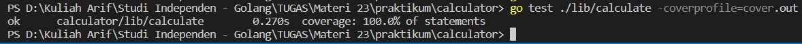
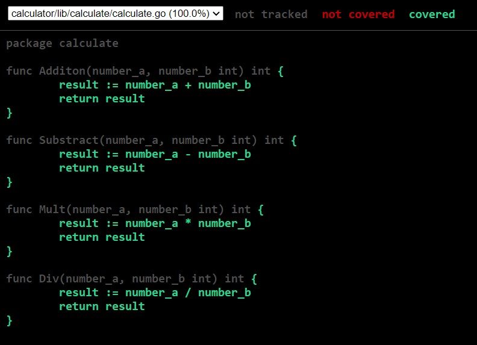

# (23) Unit Testing

## Resume
Dalam materi ini, yang dipelajari adalah :
1. Testing
2. Framework & Structure Unit Testing
3. Runner, Mocking, Coverage

### Testing
Software testing adalah proses analisa dari item software untuk memeriksa perbedaan dari kondisi sekarang dengan kondisi yang diperlukan dan untuk mengevaluasi fitur yang ada pada software. Tujuan dari testing adalah untuk menghindari regresi, level confidence pada refactoring, meningkatkan code design, code documentation, dan scalling pada tim. Level testing terdiri dari UI (interaksi User Interface), Integration (tes spesific modul pada api), dan Unit (tes pada bagian terkecil pada aplikasi).

### Framework & Structure Unit Testing
Framework pada unit testing berguna karena menyediakan tool untuk melakukan testing, dan struktur testing dibutuhkan agar testing dapat berjalan efektif, setiap bahasa pemrograman memiliki framework unit testing yang berbeda - beda. Struktur biasanya terdapat 2 pattern, yang pertama adalah centralize dimana test file berada pada test folder, lalu yang kedua adalah simpan test file bersama dengan production file.

### Runner, Mocking, Coverage
Runner adalah alat untuk menjalankan test file, biasanya menggunakan watch mode dimana jika ada perubahan pada codebase maka akan otomatis menjalankan tes lagi sehingga membuat TDD lebih efisien. Pada saat memilih runner, pilihlah yang dapat di run yang tercepat. Karena test case kita harus independen maka dalam pembuatan test harus membuat mocking agar test dapat berjalan independen. Mocking adalah suatu template atau tiruan dari object asli. Kita tidak perlu melakukan test pada 3rd party modules, database, 3rd party api atau external system, object class yang harus di test di tempat lain. Coverage bertujuan untuk mengetahui bahwa test telah di lakukan di seluruh unit, coverage tool menganalisa code aplikasi pada saat test berjalan.

## TASK
### 1. Simple Unit Testing
1. Buatlah sebuah function kalkulator diantaranya addition, subtraction, division & multiplication. Lakukan testing terhadap function tersebut.
2. Pastikan code coverage dari testing tersebut adalah 100%.

Screenshot dan kode Program dari task diatas adalah :

[calculate.go](./praktikum/calculator/lib/calculate/calculate.go)  
[calculate_test.go](./praktikum/calculator/lib/calculate/calculate_test.go)

Berdasarkan hasil test yang dilakukan didapat bahwa testing yang dilakukan semua unit berjalan dengan baik dengan coverage 100%

### RESTful API Testing
1. Duplikasi Project RESTful API yang sebelumnya telah kamu kerjakan.
2. Implementasikan Unit Testing untuk seluruh endpoint yang telah kamu buat di Project RESTful API!
3. Test case harus mencakup valid test dan invalid test.
4. Coverage Report, coba tantang dirimu mencapai testing coverage >= 80%.