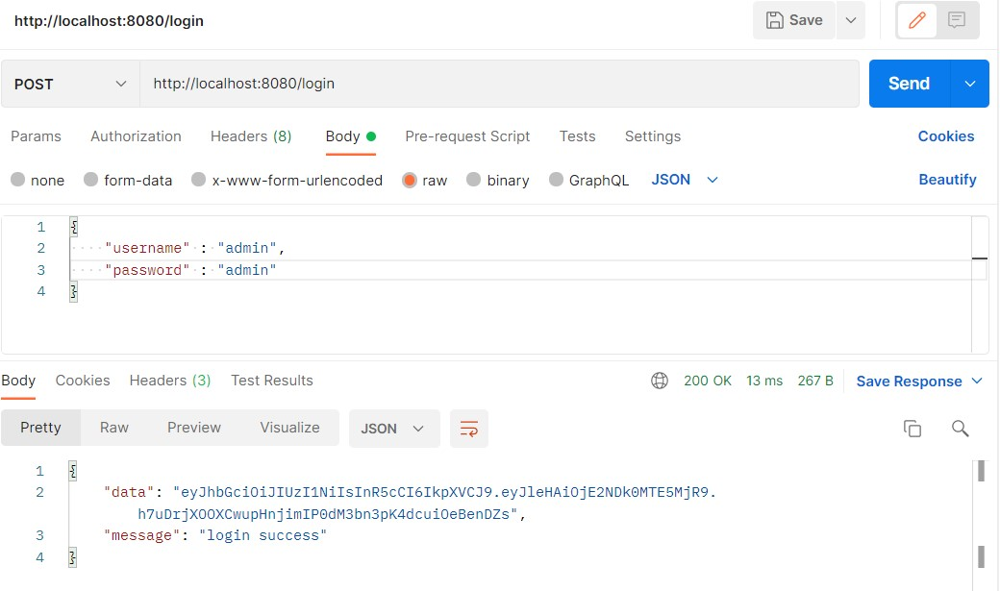
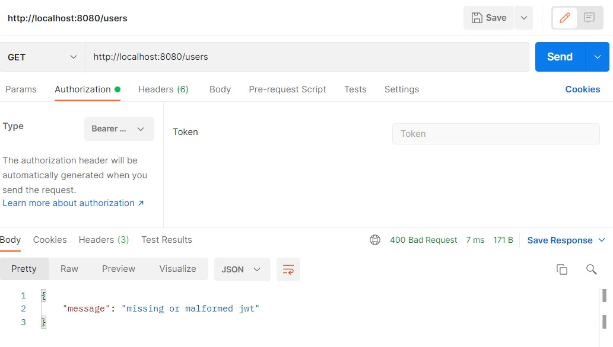
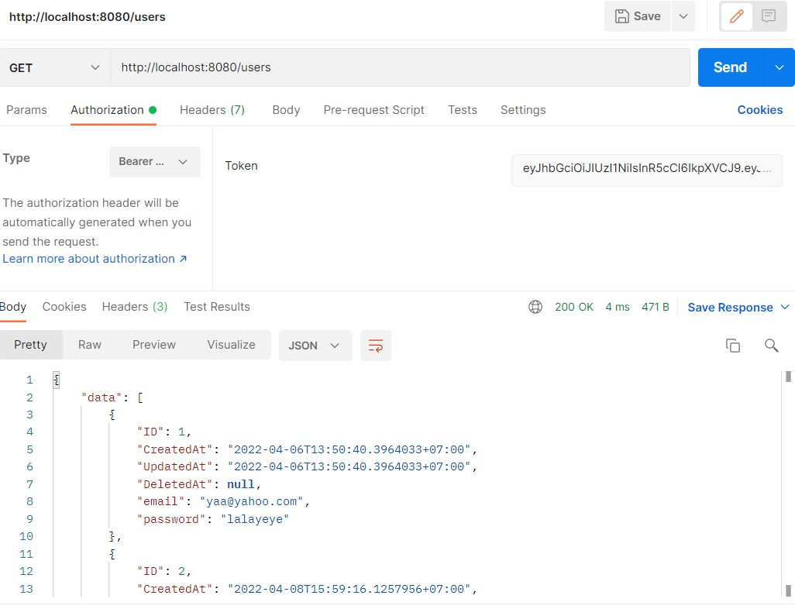

# (25) Clean Architecture JWT

## Resume
Dalam materi ini, yang dipelajari adalah :
1. Architecture
2. Clean Architecture JWT
3. CA Layer

### Architecture
Arsitektur yang baik adalah arsitektur yang pemisahan tujuan menggunakan layer untuk membuat modular, scalable, maintainable, dan testable application. tujuan dari arsitektur yang baik sendiri adalah agar mudah dalam melakukan berbagai hal termasuk dalam development dan membuat standar development application agar seluruh tim mengerti. Dalam beberapa tahun terakhir, ada berbagai ide dari arsitektur sistem seperti Hexagonal architecture, Onion architecture, Screaming architecture, DCI from Agile Development, BCE from Object Oriented Project, dan Clean Architecture. Semua arsitektur memiliki kesamaan yaitu memiliki tujuan untuk pemisahan urusan yang dapat dicapai dengan membagi software menjadi layer.

### Clean Architecture JWT
Constraint sebelum membangun clean architecture adalah Independent of framework, Testable, Independent of UI, Independent of Database, Independent of any External. Keuntungan dari clean architecture adalah :
- struktur yang standar sehingga mudah diterapkan pada project.
- faster development dalam jangka waktu yang panjang.
- mocking dependencies menjadi hal yang trivial pada unit test.
- mudah berganti dari prototype ke solusi yang sebenarnya.

Pada clean Architecture, JSON Web Token (JWT) termasuk pada controller.

### CA Layer
Kita dapat mendefinisikan dasar dari 3-layer architecture (bisa lebih layer) yaitu :
- Entity Layer : Object yang merefleksikan konsep dari managemen aplikasi (opsional)
- Use Case - Domain layer : mengandung business logic.
- Controller - Presentation Layer : menampilkan atau representasi data ke layar dan menghandle user interaction.
- Drivers - Data Layer : Memanage data aplikasi.

Domain Driver Design (DDD) adalah sebuah pendekatan untuk mengembangkan software kompleks yang menghubungkan konsep bisnis inti dan implementasi teknikal secara mendalam. Clean architecture merupakan arsitektur software sedangkan DDD merupakan teknik software design

## Task
### 1. JWT Implementation
Pada task ini, Setelah berhasil mengubah project di bawah ini menjadi Clean Architecture, tambahkan fitur authentication dengan menerapkan JWT!

[https://github.com/hadihammurabi/belajar-go-echo](https://github.com/hadihammurabi/belajar-go-echo)

Hasil dari task tersebut adalah :

[belajar-go-echo](./praktikum/belajar-go-echo)  
[jwt.go](./praktikum/belajar-go-echo/middleware/jwt.go)
[jwt_token.go](./praktikum/belajar-go-echo/helper/jwt_token.go)

1. Login untuk mendapat token
  

2. Akses handler get users tanpa token
  

3. Akses handler get users dengan token
  