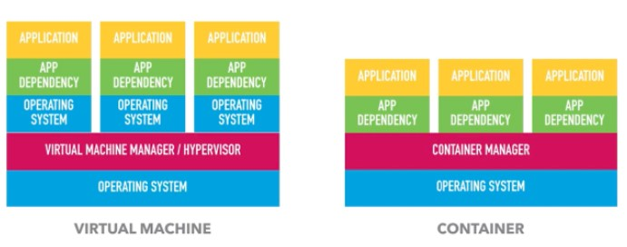
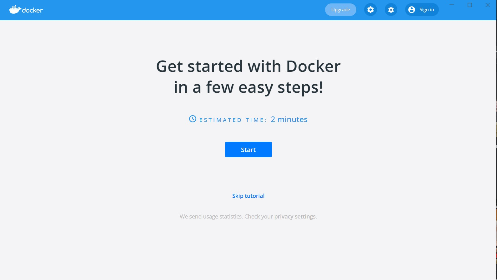
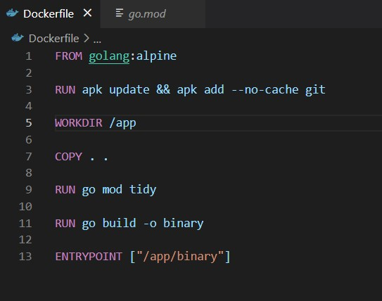
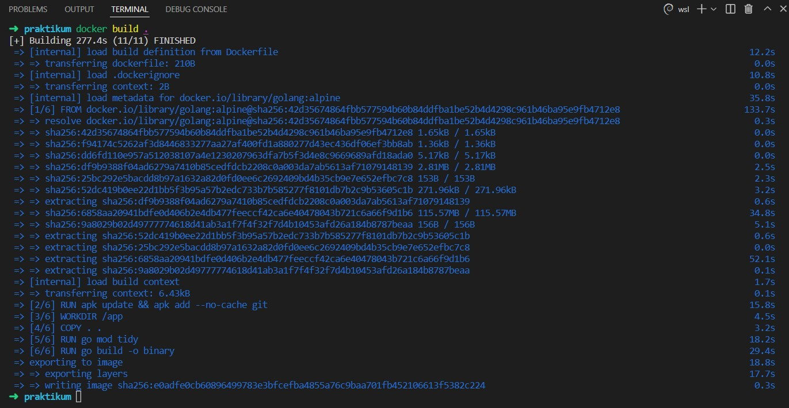
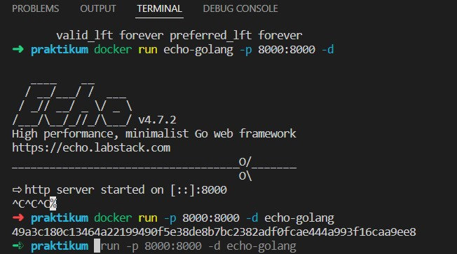
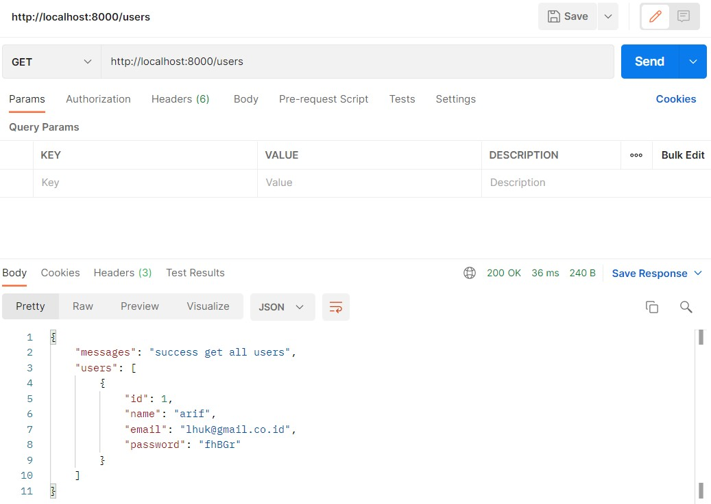

# (27) Docker

## Resume
Dalam materi ini, yang dipelajari adalah :
1. Container
2. Docker
3. Docker Infrastructure

### Container
Container adalah suatu alternative teknologi yang dapat di pergunakan untuk memvirtualisasi komputer system. Dengan mempergunakan Container kita dapat mengemas komputer programing (code) menjadi suatu unit yang standard sehingga semua dependensi dari aplikasi dapat di ikut sertakan dalam kemasan tersebut. Container merupakan paket perangkat lunak yang ringan, mandiri, dan dapat dieksekusi. Paket Container mencakup semua yang diperlukan untuk menjalankan aplikasi: kode, runtime, alat sistem, pustaka sistem, dan pengaturan.

Perbedaan antara Container dengan virtual machine adalah container tidak memerlukan OS Dependency dan hypervisor

### Docker
Docker adalah layanan yang menyediakan kemampuan untuk mengemas dan menjalankan sebuah aplikasi dalam sebuah lingkungan terisolasi yang disebut dengan container. Dengan adanya isolasi dan keamanan yang memadai memungkinkan kamu untuk menjalankan banyak container di waktu yang bersamaan pada host tertentu. Kelebihan dari docker adalah
- Memiliki konfigurasi yang sederhana
- Tingkat keamanan yang baik
- Dapat dijalankan pada beberapa platform cloud
- Dapat melakukan debugging
- Dapat digunakan pada berbagai sistem operasi

### Docker Infrastructure
Pada dasarnya docker memiliki basic seperti Image, Container, Engine, Registry, Control Plane. Infrastructure dari docker sendiri ada client yang bbugas untuk menjalankan perintah docker seperti docker build, docker pull, docker run. Lalu ada docker host yang berisi Docker Daemon, container, dan Images. Lalu ada registry. Docker dapat melakukan pembuatan docker image yang berisi container, upload and publish Image, Download and run.

## Task
### 1. Dockerize Application
Hasil dari pengerjaan task adalah :

[praktikum](./praktikum)  

- Install Docker and Docker Compose
  

- Create Docker file
  

- Clone code and integrate to docker file
  

- Build your container
  

- Deploy in your local machine
  

- Hasil Run
  
