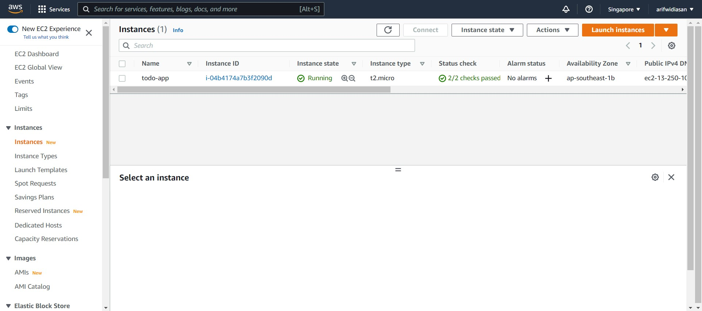
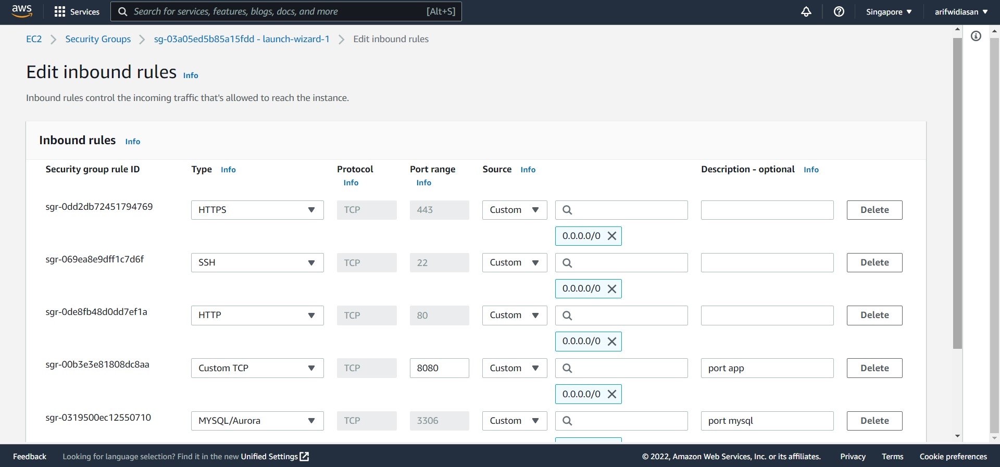
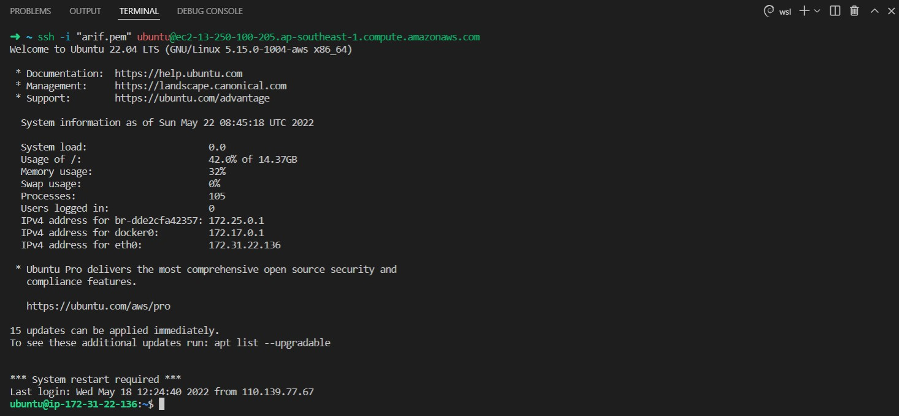
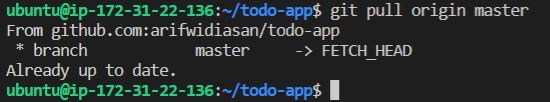
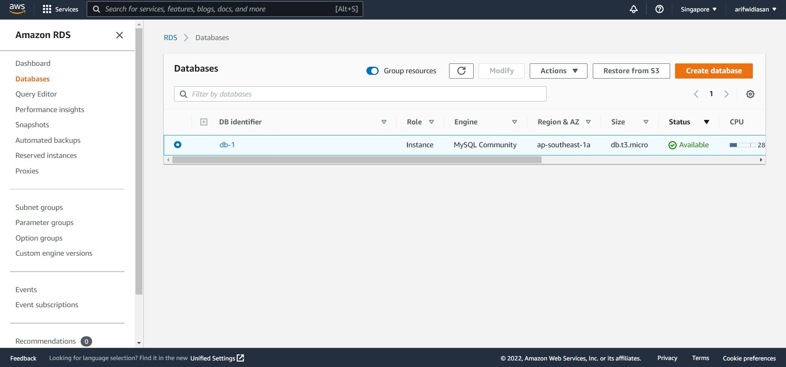

# (28) Compute Service

## Resume
Dalam materi ini, yang dipelajari adalah :
1. System & Software Deployment
2. Strategi Deployment
3. Simple Deployment Process

### System & Software Deployment
Deployment adalah kegiatan yang bertujuan untuk menyebarkan aplikasi / produk yang telah dikerjakan oleh para pengembang seringkali untuk mengubah dari status sementara ke permanen. Penyebarannya dapat melalui beragam cara tergantung dari jenis aplikasinya, aplikasi web & api ke server sedangkan aplikasi mobile ke playstore / app store.

### Strategi Deployment
- big-bang deployment strategy
- rollout deployment strategy
- blue/green deployment strategy
- canary deployment strategy

### Simple Deployment Process
- development env : localhost, dev config
- test env : test server, test config
- uat env : user acceptance, uat config
- production env : production server, production config

## Task
### 1. Deployment EC2
1. Membuat VM di EC2, dan implementasi security group EC2
  
  

2. Melakukan ssh remote ke VM di AWS EC2
  

3. Deploy program ke EC2
  

### 2. Deployment di RDS
  