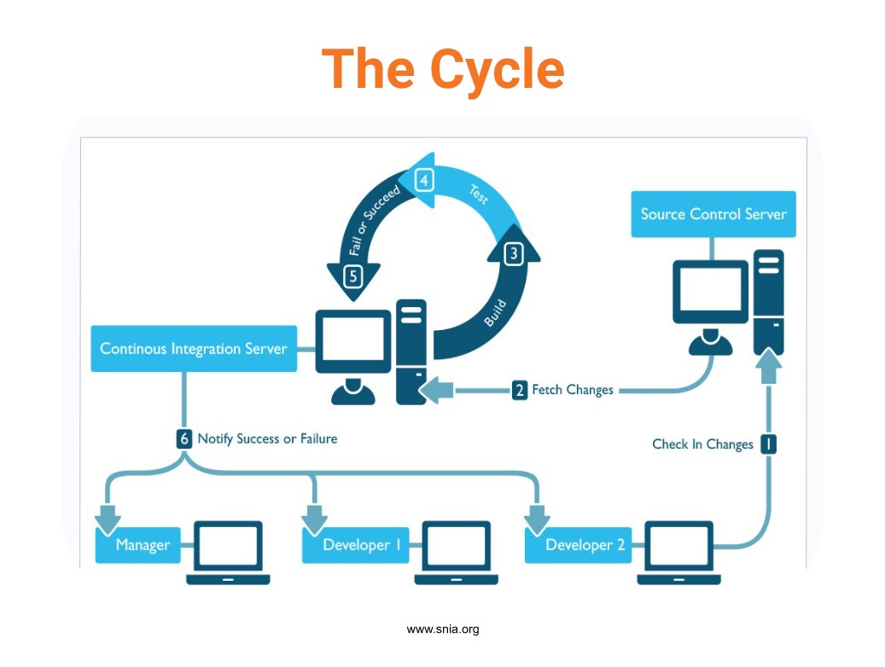
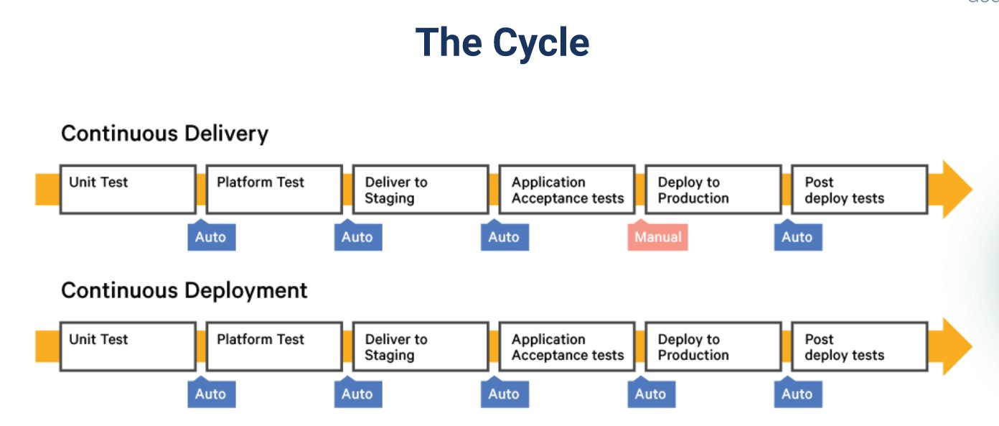
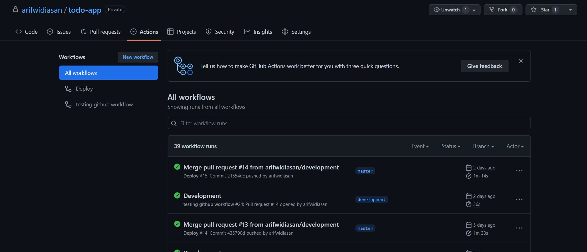

# (29) CI/CD

## Resume
Dalam materi ini, yang dipelajari adalah :
1. CI/CD
2. Cycle Continuous Integration
3. Cycle Continuous Delivery & Development

### System & Software Deployment
Continuous Integration adalah proses otomatis yang dilakukan untuk integrasi berbagai kode dari tempat yang berbeda untuk melakukan build atau melakukan test. Continuous Delivery & Development adalah proses untuk automasi deploy setiap build yang terverifikasi

### Strategi Deployment

### Simple Deployment Process

## Task
### 1. Create CI/CD to automate deployment

[CI](./praktikum/ci.yml)

[CD](./praktikum/cd.yml)

[Link Repository penerapan CI/CD](https://github.com/arifwidiasan/todo-app/actions)

