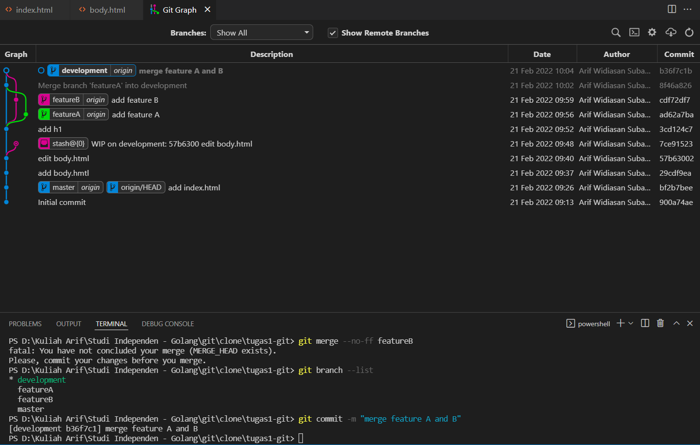

# (2) Version Control and Branch Management (Git)

## Resume
Dalam materi ini, yang dipelajari adalah :
1. Pengenalan dan Instalasi Version Control System (Git)
2. Setting up dan Push
3. Branch dan Conflict

### Pengenalan dan Instalasi Version Control System (Git)
version control system adalah sebuah tools untuk melakukan versioning (mengatur versi dari source code program). version control system sudah ada sejak tahun 1972 namun masih berupa single user pada local, lalu pada tahun 1986 sudah berupa centralized namun jika server mati maka kita tidak bisa mengerjakan pekerjaan dan harus menunggu server untuk kembali. Version control system yang banyak digunakan sekarang oleh para programmer adalah Git yang bersifat distributed sehingga memungkinkan untuk melakukan real-time collaboration work dengan tim secara bersama-sama dalam pengembangan suatu program.

### Setting up dan Push
Untuk awal setup git, yang harus kita lakukan adalah melakukan config dimana hal itu bertujuan untuk konfigurasi awal seperti username dan email dan ada init dan clone yang digunakan untuk awal repositori baru. Untuk penyimpanan perubahan ke repository bisa menggunakan git add terlebih dahulu untuk memasukkan working directory ke staging area, setelah itu git commit dan git push untuk menambahkan ke repository git. Kita juga bisa Kembali ke versi sebelumnya dengen mengecek commit sebelumnya dengan git log lalu git checkout untuk Kembali ke keadaan commit sebelumnya.

### Branch dan Conflict
Syncing pada git pada umumnya digunakan untuk menambah dan mengambil commit atau repository, peritahnya seperti git push,fetch,dan pull. Ada juga git branch yang digunakan untuk membuat cabang baru dari repository agar menghindari adanya error pada main repository, programmer biasanya melakukan pengerjaan di branch repository tersebut. Setelah pengerjaan di branch sudah benar dan tidak ada error, bisa lakukan git merge untuk meggabungkan branch ke repository utama atau branch lain. Jika pada saat melakukan merge ada conflict, maka kita harus memilih dengan tim atau dengan memahami kode untuk mengetahui mana yang harus dibenarkan pada conflict tersebut. Kita juga bisa melakukan kolaborasi dengan repository orang lain dengan melakukan pull request. 

## Task
Pada section ini, task yang diberikan adalah untuk membuat repository Github dan mengimplementasikan penggunaan branching yang terdiri dari master, development, featureA, featureB. Lalu implementasikan instruksi git untuk push, pull, stash dan merge. selain itu juga implementasikan sebuah conflict di branch saat melakukan merge.

Berikut link repository yang telah dibuat:
[file.txt](./praktikum/link repository.txt) atau langsung ke alamat [repository](https://github.com/arifwidiasan/tugas1-git)

Screenshot Git Graph repository:
