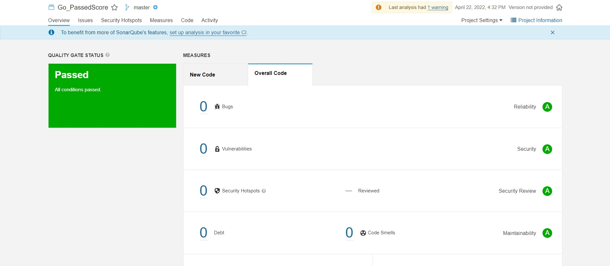

# (31) Kubernetes

## Resume
Dalam materi ini, yang dipelajari adalah :
1. Static Code Analysis
2. Linter
3. Sonarqube

### Static Code Analysis
Static code analysis adalah analisis software computer dimana dijalankan tanpa perlu melakukan eksekusi program, biasanya dilakukan sebagai bagian dari code review. Teknik yang digunakan biasanya adalah Data Flow Analysis, Taint Analysis, dan Model checking.

### Linter
Linter adalah salah satu tools untuk melakukan static code analysis dimana linter digunakan untuk menandai programming error, bug, stylistic error, dan suspicious constructs.

### Sonarqube
Sonarqube adalah platform open-source untuk melakukan continuous inspection dari kualitas code untuk perform automatic review dengan static code analysis untuk mendeteksi bug, code smell, dan security vulnerabilities.

## Task
### 1. Manual Analysis
Terdapat kode berikut ini, lakukan static analysis dan ubahlah menjadi bentuk yang lebih baik!

hasil dari task tersebut adalah sebagai berikut :

[main.go](./praktikum/main.go)

### 2. SonarQube
Lakukan analisis pada kode tersebut menggunakan SonarQube!

- Tunjukkan hasilnya dalam bentuk screenshot!
  

- Deskripsikan langkah-langkah yang dilakukan! (Karena error saat menggunakan docker, langkah berikut melakukan instalasi di windows)
  1. Download dan install java 11
  2. Download SonarQube Community Edition zip file
  3. unzip file tersebut dan jalankan \bin\windows-x86-64\StartSonar.bat di terminal
  4. masuk ke localhost:9000 dengan memasukan login dan password
  5. buat project baru dengan memilih "manually"
  6. masukkan nama project dan key project
  7. pada code integration, pilih locally
  8. masukkan nama sembarang untuk pembuatan token dan copy token tersebut
  9. pilih jenis project yang akan dianalisa, disini karena menggunakan go maka pilih others
  10. pilih OS yang digunakan saat ini
  11. akan muncul perintah untuk menjalankan scanner
  12. sebelum itu kita download dahulu sonar-scanner
  13. unzip sonar-scanner lalu tambahkan directory sonar-scanner/bin ke %PATH%
  14. buat file sonar-project.properties didalam project kita
  15. buka terminal dan jalankan perintah yang ada pada step 11
  16. setelah selesai maka hasil analisa akan muncul