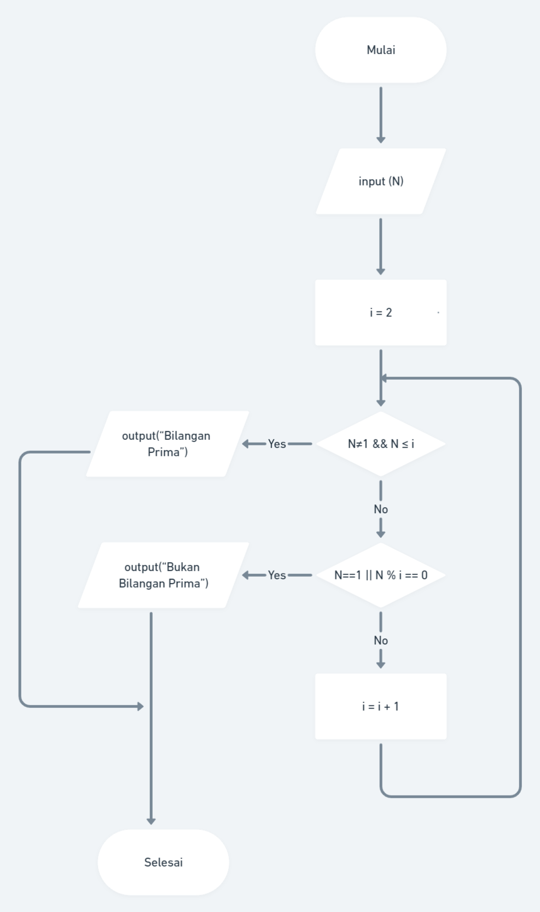
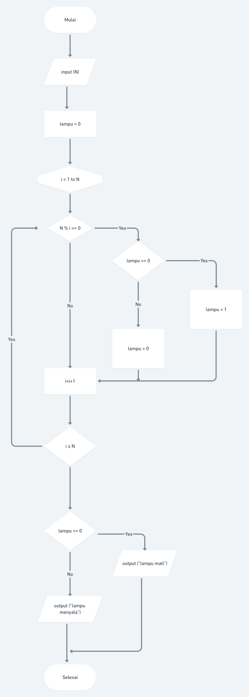

# (3) Introduction to Algorithm and Golang

## Resume
Dalam materi ini, yang dipelajari adalah :
1. Algoritma
2. Macam Algoritma Dasar
3. Pseudocode dan Flowchart

### Algoritma
Algoritma adalah prosedur komputasi yang didefinisikan dengan baik yang mengambil beberapa nilai sebagai input dan menghasilkan beberapa nilai sebagai output. Karakteristik algoritma antara lain memiliki awal dan akhir, instruksi terdefinisi dengan baik, efektif dan efisien. Contoh algoritma adalah mencari bilangan prima, pengurutan, dan pencarian.

### Macam Algoritma Dasar
Ada beberapa jenis algoritma dasar seperti sequential, branching, dan looping. Sequential adalah urutan Langkah-langkah untuk menyelesaikan suatu masalah. Branching adalah untuk menentukan flow atau alur dari kondisi tertentu. Looping adalah konsep untuk melakukan aksi secara berulang sampai kondisi tertentu.

### Pseudocode dan Flowchart
Pseudocode adalah penulisan algoritma dengan deskripsi Bahasa sederhana yang dapat menyerupai Bahasa pemrograman apapun atau Bahasa penggunaan sehari-hari, sedangkan flowchart adalah suatu bagan dengan symbol tertentu yang menggambarkan urutan dan hubungan antar proses secara mendetail.

## Task
### 1. Flowchart Bilangan Prima
pada task ini, membuat flowchart untuk menentukan bilangan prima menggunakan [whimsical.com](whimsical.com)

berikut hasil pengerjaan di website whimsical pada [file txt](./praktikum/1.link-whimsical-prima.txt) atau [tautan berikut](https://whimsical.com/bilangan-prima-Ezr7CbKDebDfMK7Kii8Kho)

Gambar flowchart :

### 2. Flowchart Lampu dan Tombol
pada task ini, membuat flowchart untuk lampu dan tombol dengan permasalahan berikut :  
> Terdapat N tombol yang dinomori dari 1 hingga N dan sebuah lampu dalam keadaan mati. Apabila tombol ke-i ditekan, keadaan lampu akan berubah (dari mati menjadi menyala, atau sebaliknya) jika N habis dibagi oleh i. Apabila masing-masing tombol ditekan tepat sekali, bagaimana keadaan lampu pada akhirnya ?  

> contoh masukan :  
5  
contoh keluaran :  
lampu mati    
contoh masukan :  
4  
contoh keluaran :  
lampu menyala  

berikut hasil pengerjaan di website whimsical pada [file txt](./praktikum/1.link-whimsical-tombol.txt) atau [tautan berikut](https://whimsical.com/lampu-tombol-VtjEzeBjECb9CJHTLciuAV)

Gambar Flowchart :

