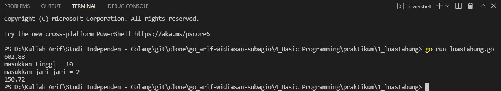
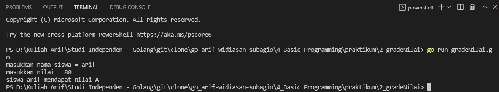

# (4) Basic Programming

## Resume
Dalam materi ini, yang dipelajari adalah :
1. Golang
2. Variable
3. Branching & Looping

### Golang
Golang adalah salah satu bahasa backend yang sedang popular saat ini, golang merupakan Bahasa pemrograman open source yang dikembangkan oleh google. Bahasa ini dikembangkan dengan tujuan untuk mempermudah proses development namun tetap simple,handal, dan efisien. Golang merupakan Bahasa yang bagus untuk menulis low-level program yang bisa digunakan untuk membuat program aplikasi dan program system.

### Variable
Variable digunakan untuk menyimpan informasi pada program komputer dimana variable memberikan labelling data dengan deskripsi nama dan memiliki tipe data seperti Boolean,numeric, dan string. Golang juga ada operasi menggunakan operator aritmatika, Boolean, dan bitwise.

### Branching & Looping
Branching pada golang ada if else dan switch, untuk perulangan pada umunya menggunakan for, for juga bisa digunakan untuk perulangan while. Pada perulangan for juga bisa diberikan continue dan break dimana continue bertujuan untuk meneruskan perulangan dan break untuk menghentikan perulangan.

## Task
### 1. Menghitung Luas Permukaan Tabung
Buatlah sebuah program untuk menghitung luas permukaan tabung !. setelah program berhasil dibuat, coba lakukan improvement dengan merubah agar inputan menjadi scanf !.
> input : T = 20, r = 4  
output : 602.88

Berikut kode hasil dari task ini :

[luasTabung.go](./praktikum/1_luasTabung/luasTabung.go)

Hasil kode program :

### 2. Grade Nilai
Seorang pengajar sedang memeriksa ujian siswa dan akan memberikan deskripsi nilai dari A-E dengan ketentuan sebagai berikut : 
> - Nilai 80-100 : A
- Nilai 65-79 : B
- Nilai 50-64 : C
- Nilai 35-49 : D
- Nilai 0-34 : E
Tampilkan deskripsi Nilai dan Nama siswa saat pengajar tersebut memasukkan nilai dan nama yang dia inginkan.

Berikut kode hasil dari task ini :

[gradeNilai.go](./praktikum/2_gradeNilai/gradeNilai.go)

Hasil kode program :

