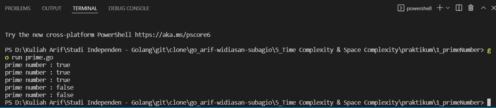
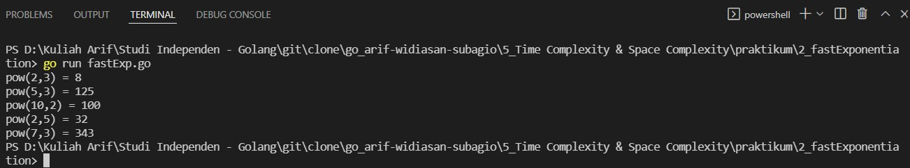
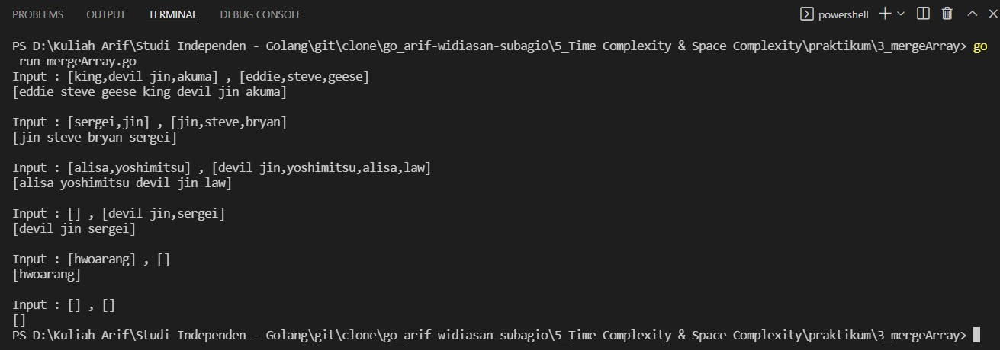
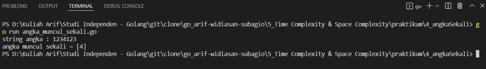
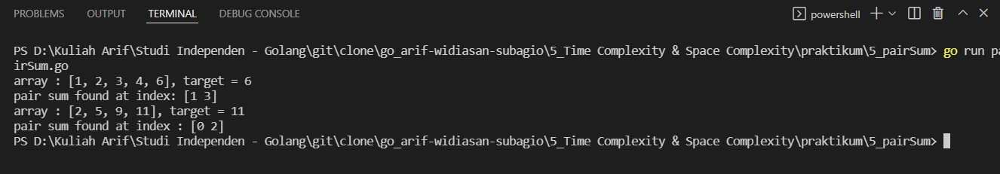

# (5) Time Complexity & Space Complexity

## Resume
Dalam materi ini, yang dipelajari adalah :
1. Time Complexity
2. Perbedaan Tiap Time Complexity
3. Space Complexity

### Time Complexity
Penggunaan time complexity memudahkan untuk memperkirakan waktu yang dibutuhkan untuk program tersebut berjalan. complexity dapat dilihat sebagai maximum number dari primitive opperation yang program tersebut mungkin dieksekusi, operasi atau operator tersebut dinamakan dominan. complexity dilambangkan dengan Big-O Notation.

### Perbedaan Tiap Time Complexity
ada banyak sekali jenis time complexity, antara lain adalah :
- Constant Time : O(i)
- Linear Time : O(n) atau O(n+m)
- Logarithmic Time : O(log n)
- Quadratic Time : O(n^2)

setiap time complexity memiliki waktu eksekusi yang berbeda-beda dan dapat dilihat pada gambar berikut

### Space Complexity
Memory limit memberikan informasi untuk memperkirakan space complexity. kita bisa memperkirakan banyak variabel yang kamu deklarasikan pada program, dengan kata lain jika kita memiliki angka konstan variabel maka kita juga mempunyai space complexity yang konstan

## Task
### 1. Bilangan Prima
pada task ini, buatlah program untuk menentukan bilangan tersebut termasuk bilangan prima atau tidak dengan kompleksitas lebih cepat dari O(n) atau O(n/2)
>input : 1000000007  
Output: Bilangan Prima

Berikut kode dari task ini :

[prime.go](./praktikum/1_primeNumber/prime.go)

Hasil kode program :

### 2. Fast Exponentiation
pada task ini, buatlah fungsi program untuk menghitung x^n dengan kompleksitas lebih optimal dari O(n) yaitu logarithmic time (O(log n))
>input : x = 2, n = 3  
Output: 8

>fmt.Println(pow(2, 3))  // 8  
fmt.Println(pow(5, 3))  // 125  
fmt.Println(pow(10, 2)) // 100  
fmt.Println(pow(2, 5))  // 32  
fmt.Println(pow(7, 3))  // 343

Berikut kode dari task ini :

[fastExp.go](./praktikum/2_fastExponentiation/fastExp.go)

Hasil kode program :

### 3. Array Merge
pada task ini, Buatlah sebuah program menggabungkan 2 array yang diberikan, dan jangan sampai terdapat nama yang sama di data yang sudah tergabung tadi. (Structure Data , No BruteForce)
>Input: ['kazuya', 'jin', 'lee'], ['kazuya', 'feng']  
Output: ['kazuya', 'jin', 'lee', 'feng']

Berikut kode dari task ini :

[mergeArray.go](./praktikum/3_mergeArray/mergeArray.go)

Hasil kode program :

### 4. Angka Muncul Sekali
pada task ini, Buat program sesuai dengan deskripsi di bawah. Input merupakan variable string berisi kumpulan angka. Output merupakan list / array berisi angka yang hanya muncul 1 kali pada input.
>Input: “76523752”  
Output: [6, 3]

Berikut kode dari task ini :

[angka_muncul_sekali.go](./praktikum/4_angkaSekali/angka_muncul_sekali.go)

Hasil kode program :

### 5. Pair with Target Sum
pada task ini, diberikan array bilangan berurut dan target sum, cari pasangan pada array dimana bila ditambahkan maka hasilnya sama dengan target sum. buat fungsi yang mengembalikan nilai index dari pasangan pada array yang berjumlah sama dengan target. tantangan pada task ini adalah mengerjakan dengan linear complexity O(n).
>Input: [1, 2, 3, 4, 6], target=6  
Output: [1, 3]  
Explanation: The numbers at index 1 and 3 add up to 6: 2+4=6

Berikut kode dari task ini :

[pairSum.go](./praktikum/5_pairSum/pairSum.go)

Hasil kode program :

