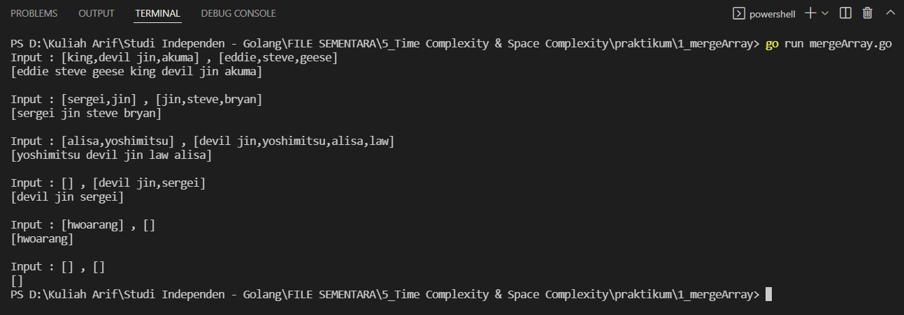
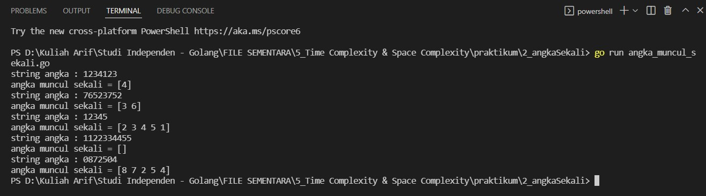
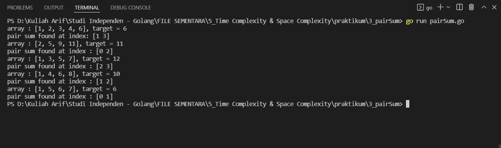

# (6) Data Structure

## Resume
Dalam materi ini, yang dipelajari adalah :
1. Array dan Slice
2. Map
3. Function

## Task
### 1. Array Merge
pada task ini, Buatlah sebuah program menggabungkan 2 array yang diberikan, dan jangan sampai terdapat nama yang sama di data yang sudah tergabung tadi. (Structure Data , No BruteForce)
>Input: ['kazuya', 'jin', 'lee'], ['kazuya', 'feng']  
Output: ['kazuya', 'jin', 'lee', 'feng']

Berikut kode dari task ini :

[mergeArray.go](./praktikum/1_mergeArray/mergeArray.go)

Hasil kode program :

### 2. Angka Muncul Sekali
pada task ini, Buat program sesuai dengan deskripsi di bawah. Input merupakan variable string berisi kumpulan angka. Output merupakan list / array berisi angka yang hanya muncul 1 kali pada input.
>Input: “76523752”  
Output: [6, 3]

Berikut kode dari task ini :

[angka_muncul_sekali.go](./praktikum/2_angkaSekali/angka_muncul_sekali.go)

Hasil kode program :

### 3. Pair with Target Sum
pada task ini, diberikan array bilangan berurut dan target sum, cari pasangan pada array dimana bila ditambahkan maka hasilnya sama dengan target sum. buat fungsi yang mengembalikan nilai index dari pasangan pada array yang berjumlah sama dengan target. tantangan pada task ini adalah mengerjakan dengan linear complexity O(n).
>Input: [1, 2, 3, 4, 6], target=6  
Output: [1, 3]  
Explanation: The numbers at index 1 and 3 add up to 6: 2+4=6

Berikut kode dari task ini :

[pairSum.go](./praktikum/3_pairSum/pairSum.go)

Hasil kode program :

