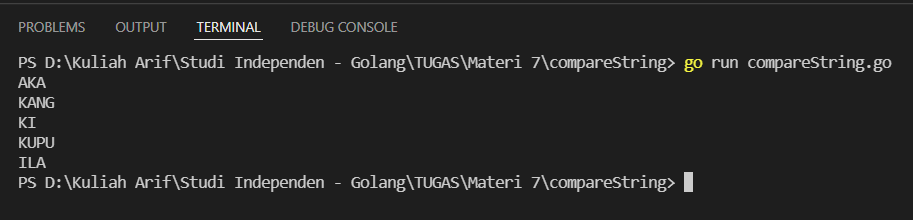
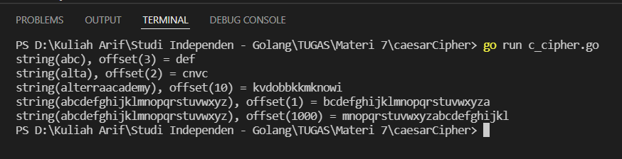
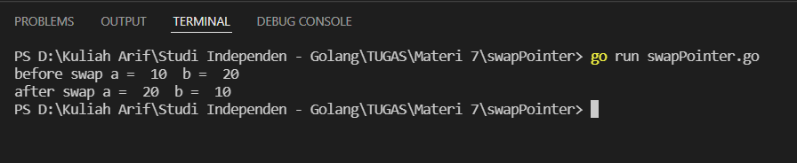
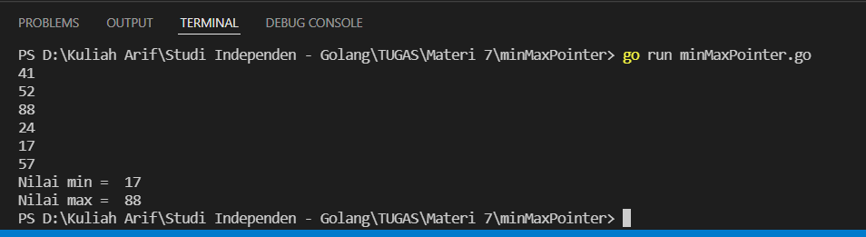
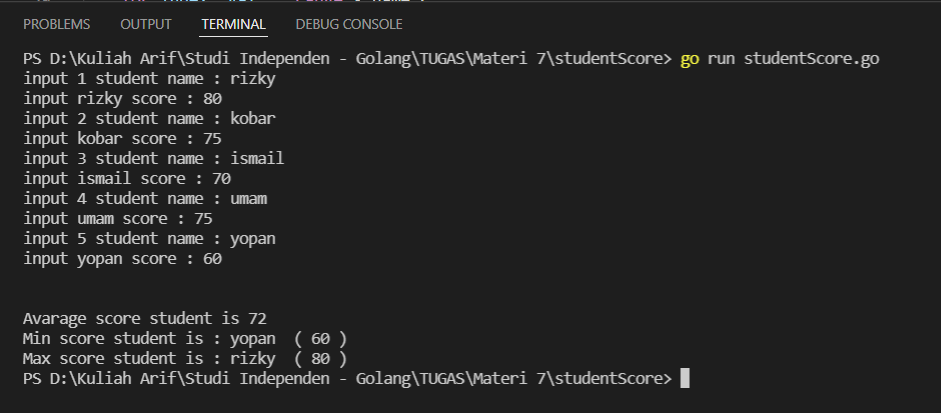
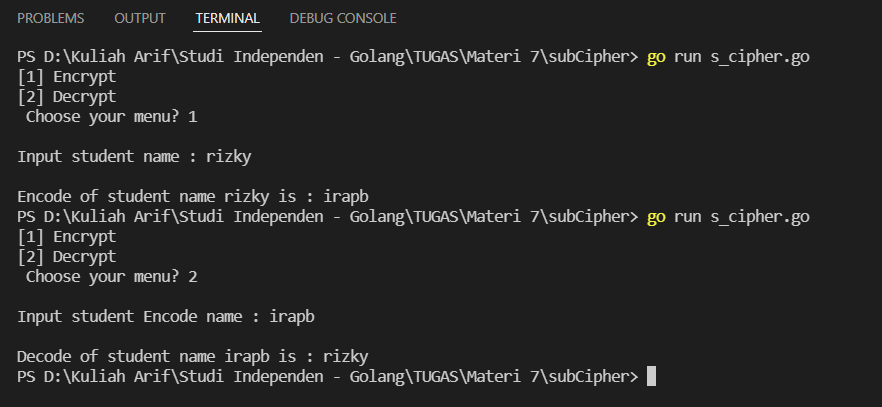

# (7) String - Advance Function - Pointer - Method - Struct and Interface

## Resume
Dalam materi ini, yang dipelajari adalah :
1. String dan Advance Function
2. Pointer dan Struct
3. Method dan Interface

### String dan Advance Function
String memiliki fungsi lain yang berguna untuk membantu kita dalam pemrograman, contoh nya seperti berikut :  
- len : mengetahui panjang string  
- compare : untuk membandingkan 2 string  
- contains : mengetahui apakah string merupakan substring dari string lain  
- substring : untuk mengambil substring dari string lain  
- replace : untuk mengubah isi string dengan string lain  
- insert : memasukkan string ke dalam string

ada function lain yang masuk kedalam advance function, antara lain adalah variadic function untuk membuat function dimana banyak input parameter tidak diketahui, anonymous function adalah function yang tidak memiliki nama yang berguna untuk membuat in-line function, closure function adalah seperti anonymous function yang references variable dideklarasikan diluar fungsi itu sendiri, yang terakhir defer function adalah fungsi yang dieksekusi terakhir dan bila ada multiple defer function akan dieksekusi seperti stack.

### Pointer dan Struct
Pointer adalah variabel yang menyimpan alamat memori dari variabel lain, pointer memiliki operator untuk dereferencing (*) untuk mendapat value dari alamat memori dan referencing (&) untuk mendapat alamat memori dari variabel ke pointer. struct adalah user-defined type yang memiliki koleksi dari named field/properties atau function (methods).

### Method dan Interface
Method adalah function yang berkaitan dengan type (bisa struct atau tipe data lain), untuk deklarasi method sama dengan function namun hanya deklarasi dari object variabel harus ditambah diantara func keyword dan func name. method dapat digunakan untuk membantu dalam penulisan kode dengan object-oriented style,menghindari name conflict, dan mudah dibaca. Interface sendiri adalah koleksi dari method signature dimana object bisa diimplementasikan. karena nya interface mendefinisikan perilaku object.

## Task
### 1. Compare String
pada task ini diberikan dua string A dan B, tentukan common substring antara kedua string tersebut
>Input : A="AKA", B="AKASHI"  
output : AKA

>fmt.Println(Compare("AKA", "AKASHI")) // AKA  
fmt.Println(Compare("KANGOORO", "KANG")) // KANG  
fmt.Println(Compare("KI", "KIJANG")) // KI  
fmt.Println(Compare("KUPU-KUPU", "KUPU")) // KUPU  
fmt.Println(Compare("ILALANG", "ILA")) // ILA  

Berikut kode dari task ini :

[compareString.go](./praktikum/1_compareString/compareString.go)

Hasil kode program :

### 2. Caesar Cipher
pada task ini, buat method untuk mengambil integer offset dan string untuk membuat string baru dimana setiap huruf di-shift dengan offset, asumsi bahwa string hanya mengandung huruf kecil alphabet. pada saat shift huruf "z" dengan offset 3 maka hasilnya adalah "c".
>Input : offset = 3, string = "abc"  
output : def

>input : offset = 1, string = "abcdefghijklmnopqrstuvwxyz"  
output : bcdefghijklmnopqrstuvwxya

Berikut kode dari task ini :

[c_cipher.go](./praktikum/2_caesarCipher/c_cipher.go)

Hasil kode program :

### 3. Swap Pointer
pada task ini, buat fungsi untuk menukar nilai a dengan b dan sebaliknya menggunakan pointer.
>Input : a = 10, b = 20  
output : a = 20, b = 10

Berikut kode dari task ini :

[swapPointer.go](./praktikum/3_swapPointer/swapPointer.go)

Hasil kode program :

### 4. Min dan Max using pointer
pada task ini, buat fungsi untuk mencari nilai maximal dan nilai minimal di antara 6 inputan dengan multiple return dan pointer untuk referencing dan deferencing
>Input :  
1  
2  
3  
9  
7  
8  
output :  
9 is maximum number  
1 is minimum number

Berikut kode dari task ini :

[minMaxPointer.go](./praktikum/4_minMaxPointer/minMaxPointer.go)

Hasil kode program :

### 5. Student Score
Buat sebuah struct dengan nama Student yang mempunyai properti name dan score dalam bentuk slice kemudian simpan data siswa sebanyak 5 siswa. Setelah 5 siswa dimasukkan maka program menunjukkan skor rata-rata, siswa yang memiliki skor minimum dan maksimal ? (implementasikan method)  
>Input:  
Input 1 Student's Name Rizky  
Input 1 Student's Score 80  
Input 2 Student's Name Kobar  
Input 2 Student's Score 75  
Input 3 Student's Name Ismail  
Input 3 Student's Score 70  
Input 4 Student's Name Umam  
Input 4 Student's Score 75  
Input 5 Student's Name Yopan  
Input 5 Student's Score 60  
Output:  
Average Score: 72  
Min Score of Students: Yopan (60)  
Max Score of Students: Rizky (80)

Berikut kode dari task ini :

[studentScore.go](./praktikum/5_studentScore/studentScore.go)

Hasil kode program :

### 6. Substitution Cipher
pada task ini, Implementasikan interface yang terdiri dari metode encode dan decode. algoritma enkripsi yang digunakan adalah substitusi cipher
>Input :  
1.encrypt  
2.decrypt  
Choose your menu? 1  
Input student name : rizky  
output :  
Encoded of student name rizky is irapb

Berikut kode dari task ini :

[s_cipher.go](./praktikum/6_subCipher/s_cipher.go)

Hasil kode program :

