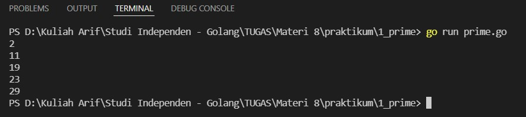
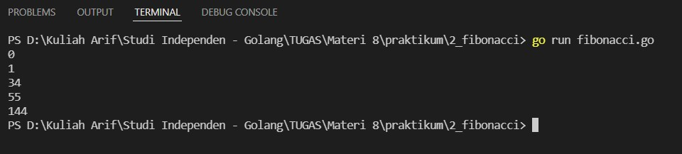
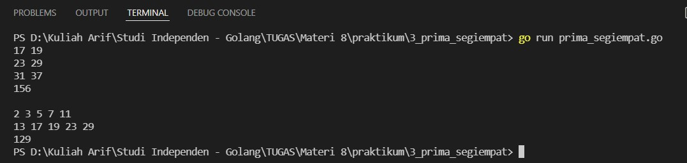
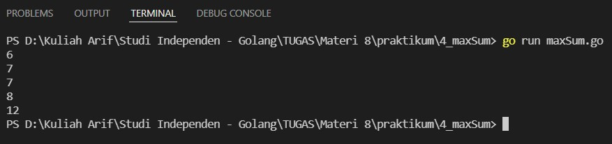
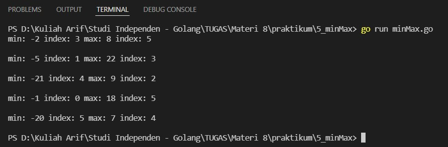
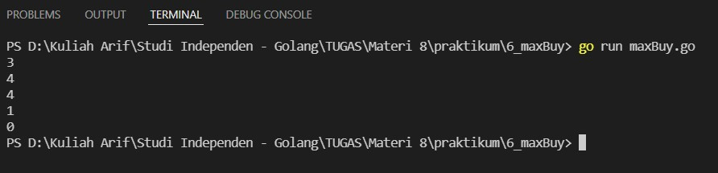
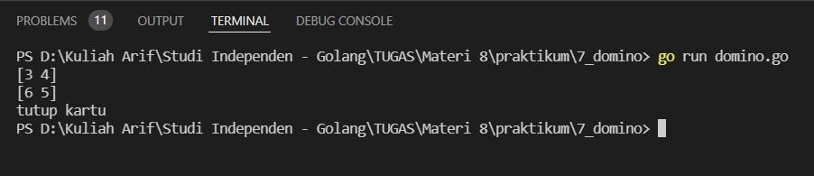
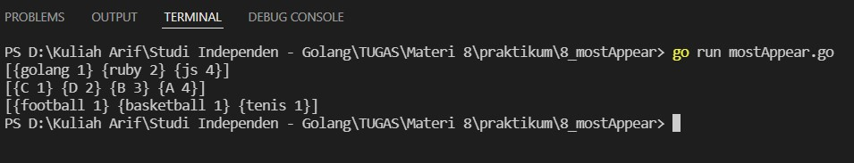

# (8) Recursive - Number Theory - Sorting - Searching

## Resume
Dalam materi ini, yang dipelajari adalah :
1. Recursive and Number Theory
2. Sorting and Searching
3. Macam lain data structure

### Recursive and Number Theory
Rekursif merupakan function yang dapat memanggil dirinya sendiri, jika problem yang dihadapi kecil maka rekursif dapat memunculkan jawaban dengan cepat, namun jika problem yang dihadapi besar maka rekursif akan memanggil dirinya sendiri dengan scope problem yang diperkecil. rekursif berguna karena banyak program yang dapat diselesaikan dengan mudah dan memperkecil kode dengan pendekatan rekursif.  
Number theory adalah cabang ilmu matematika yang mempelajari tentang integer. topic yang dibahas pada number theory ada berbagai macam seperti bilangan prima, faktor persekutuan terbesar, faktor persekutuan terkecil, faktorial, prime factor dan masih banyak lagi.

### Sorting and Searching
searching adalah proses untuk menemukan posisi value dari daftar value yang diberikan. ada berbagai macam searching seperti linear search, binary search, dan fibonacci search. di golang sendiri ada juga builtin search.  
sorting adalah proses untuk mengurutkan data dengan order tertentu (ascending atau descending), biasanya yang diurutkan adalah value dari elemen. pengurutan yang paling sering digunakan adalah pengurutan angka dan huruf. macam - macam dari sorting antara lain selection sort, count sort, merge sort dan masih banyak lagi. di golang sendiri juga ada builtin untuk sorting.

### Macam Lain Data Structure
stack merupakan data struktur yang memiliki ciri khas LIFO (last in - first out) dimana data terakhir yang masuk adalah data yang pertama kali dikeluarkan nanti. Queue adalah data struktur yang memiliki ciri khas FIFO (first in - first out) dimana data pertama yang masuk adalah data pertama yang keluar, ada beberapa type dari queue seperti simple queue, priority queue, dan deque.  
set merupakan jenis array yang tidak boleh duplicate, map merupakan elemen yang dapat berisi lebih dari 1 komponen.

## Task
### 1. Prima ke X
Dalam matematika, bilangan prima adalah bilangan asli yang lebih besar dari angka 1, yang faktor pembaginya adalah 1 dan bilangan itu sendiri. Angka 2 dan 3 adalah bilangan prima. Angka 4 bukan bilangan prima karena 4 bisa dibagi 2. Sepuluh deret bilangan prima yang pertama adalah 2, 3, 5, 7, 11, 13, 17, 19, 23 dan 29.  
Buatlah sebuah fungsi yang menampilkan bilangan prima sesuai dengan deret urutannya.
>Input: 5  
Output: 11

>fmt.Println(primeX(1)) // 2  
fmt.Println(primeX(5)) // 11  
fmt.Println(primeX(8)) // 19  
fmt.Println(primeX(9)) // 23  
fmt.Println(primeX(10)) // 29

Berikut kode dari task ini :

[prime.go](./praktikum/1_prime/prime.go)

Hasil kode program :

### 2. Fibonacci (Recursive)
pada task ini, buatlah fungsi untuk mengetahui bilangan fibonacci ke-n. fungsi yang dibuat didefinisikan secara rekursif.
>Input: 10  
Output: 55

> fmt.Println(fibonacci(0)) // 0  
fmt.Println(fibonacci(2)) // 1  
fmt.Println(fibonacci(9)) // 34  
fmt.Println(fibonacci(10)) // 55  
fmt.Println(fibonacci(12)) // 144

Berikut kode dari task ini :

[fibonacci.go](./praktikum/2_fibonacci/fibonacci.go)

Hasil kode program :

### 3. Prima Segi Empat
pada task ini, Buatlah segiempat berukuran high x wide yang berisikan bilangan bilangan prima setelah start, pada bagian akhir jumlahkan seluruh bilangan prima tersebut.
>Input: primaSegiEmpat(2, 3, 13)  
Output:  
17 19  
23 29  
31 37  
156

>Input: primaSegiEmpat(5, 2, 1)  
Output:  
2 3 5 7 11  
13 17 19 23 29  
129

Berikut kode dari task ini :

[prima_segiempat.go](./praktikum/3_prima_segiempat/prima_segiempat.go)

Hasil kode program :

### 4. Total Maksimum dari Deret Bilangan
pada task ini, buatlah program yang harus menemukan total maksimum jumlah bilangan dari deret sebuah list integer secara berurutan.
>Input: [-2, 1, -3, 4, -1, 2, 1, -5, 4]  
Output: 6  
Penjelasan: 6 adalah hasil penambahan dari deret 4, -1, 2, 1

>fmt.Println(MaxSequence([]int{-2, 1, -3, 4, -1, 2, 1, -5, 4})) // 6  
fmt.Println(MaxSequence([]int{-2, -5, 6, -2, -3, 1, 5, -6})) // 7  
fmt.Println(MaxSequence([]int{-2, -3, 4, -1, -2, 1, 5, -3})) // 7  
fmt.Println(MaxSequence([]int{-2, -5, 6, -2, -3, 1, 6, -6})) // 8  
fmt.Println(MaxSequence([]int{-2, -5, 6, 2, -3, 1, 6, -6})) // 12

Berikut kode dari task ini :

[maxSum.go](./praktikum/4_maxSum/maxSum.go)

Hasil kode program :

### 5. Find Min and Max Number
pada task ini, Buatlah sebuah program untuk mencari bilangan minimum dan maksimum dari sebuah array, dan di problem ini kamu tidak boleh melakukan pengurutan terhadap array. Dan munculkan index dari bilangan minimum dan maksimum tersebut.
>Input: [5, 7, 4, -2, -1, 8]  
Output: min: -2 index: 3 max: 8 index: 5

>fmt.Println(FindMinAndMax([]int{5, 7, 4, -2, -1, 8}))  
// min: -2 index: 3 max: 8 index: 5  
fmt.Println(FindMinAndMax([]int{2, -5, -4, 22, 7, 7}))  
// min: -5 index: 1 max: 22 index: 3  
fmt.Println(FindMinAndMax([]int{4, 3, 9, 4, -21, 7}))  
// min: -21 index: 4 max: 9 index: 2  
fmt.Println(FindMinAndMax([]int{-1, 5, 6, 4, 2, 18}))  
// min: -1 index: 0 max: 18 index: 5  
fmt.Println(FindMinAndMax([]int{-2, 5, -7, 4, 7, -20}))  
// min: -20 index: 5 max: 7 index: 4

Berikut kode dari task ini :

[minMax.go](./praktikum/5_minMax/minMax.go)

Hasil kode program :

### 6. Maximum Buy Product
Kamu diminta untuk membeli sebuah barang, dan tantangan kali ini kamu harus bisa membeli barang dengan jumlah maksimum dengan uang yang kamu miliki. Program ini menerima pertama money parameter pertama, dan yang kedua berupa harga list produk yang bisa kamu beli. Kamu harus menampilkan nilai jumlah barang yang bisa dibeli.
>Input: money = 50000, productPrice = [25000, 25000, 10000, 14000]  
Output: 3

>MaximumBuyProduct(50000, []int{25000, 25000, 10000, 14000})  
// 3  
MaximumBuyProduct(30000, []int{15000, 10000, 12000, 5000, 3000})  
// 4  
MaximumBuyProduct(10000, []int{2000, 3000, 1000, 2000, 10000})  
// 4  
MaximumBuyProduct(4000, []int{7500, 3000, 2500, 2000})  
// 1  
MaximumBuyProduct(0, []int{10000, 30000})  
// 0

Berikut kode dari task ini :

[maxBuy.go](./praktikum/6_maxBuy/maxBuy.go)

Hasil kode program :

### 7. Playing Domino
Yuk kita bermain domino, syarat dari permainan domino adalah kartu yang disarankan untuk dikeluarkan adalah kartu yang salah satu angkanya sama dengan kartu yang ada di deck, dan jumlah kartu tersebut merupakan jumlah terbesar. Jika tidak ada kartu yang memenuhi maka kamu perlu "tutup kartu".

Buatlah program playingDomino yang menerima 2 parameter array.
- Parameter pertama merupakan kartu domino yang ada di tangan.
- Parameter kedua merupakan kartu yang sedang ada di deck.

Jika ada kartu yang disarankan maka output: [x,y], jika tidak ada kartu yang sesuai maka keluarkan: 'tutup kartu'.
>Input: kartu = [[6, 5], [3, 4], [2, 1], [3, 3]], deck = [4, 3]  
Output: [3, 4]

>fmt.Println(playingDomino([][]int{[]int{6, 5}, []int{3, 4}, []int{2, 1}, []int{3, 3}}, []int{4, 3}))  
// [3 , 4]  
fmt.Println(playingDomino([][]int{[]int{6, 5}, []int{3, 3}, []int{3, 4}, []int{2, 1}}, []int{3, 6}))  
// [6 , 5]  
fmt.Println(playingDomino([][]int{[]int{6, 6}, []int{2, 4}, []int{3, 6}}, []int{5, 1}))  
// "tutup kartu"

Berikut kode dari task ini :

[domino.go](./praktikum/7_domino/domino.go)

Hasil kode program :

### 8. Most Appear Item
pada task ini, Buatlah sebuah program Most Appear Item yang dapat mengurutkan barang berdasarkan jumlah kemunculannya. Jika ada barang yang duplicate kamu hanya perlu memunculkan sekali, namun kamu perlu menampilkan total kemunculan barang tersebut.
>Input: ["js", "js", "golang", "ruby", "ruby", "js", "js"]  
Output: golang->1 ruby->2 js->4

>fmt.Println(MostAppearItem([]string{"js", "js", "golang", "ruby", "ruby", "js", "js"}))  
// golang->1 ruby->2 js->4  
fmt.Println(MostAppearItem([]string{"A", "B", "B", "C", "A", "A", "B", "A", "D", "D"}))  
// C->1 D->2 B->3 A->4  
fmt.Println(MostAppearItem([]string{"football", "basketball", "tenis"}))  
// football->1 basketball->1 tenis->1

Berikut kode dari task ini :

[mostAppear.go](./praktikum/8_mostAppear/mostAppear.go)

Hasil kode program :

