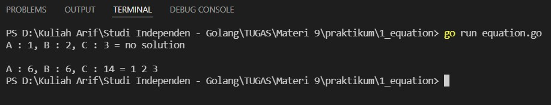
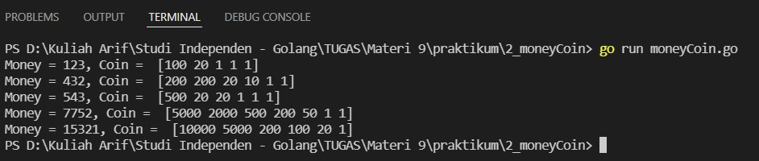
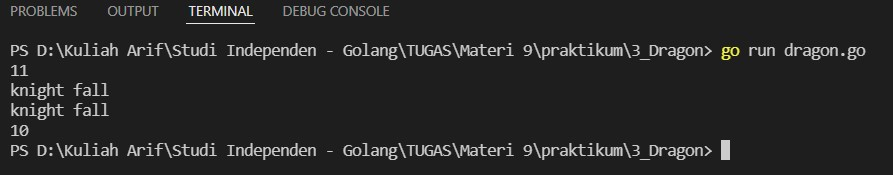
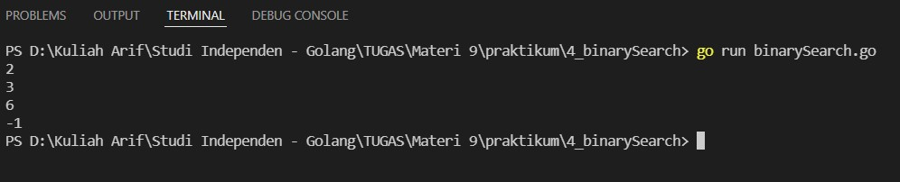

# (9) Brute Force - Greedy and Divide and Conquer

## Resume
Dalam materi ini, yang dipelajari adalah :
1. Problem Solving Paradigm dan Brute Force
2. Greedy dan Divide & Conquer
3. Dynamic Programming

### Problem Solving Paradigm dan Brute Force
Problem solving paradigm adalah pendekatan umum untuk menyelesaikan masalah seperti brute force, divide and conquer, greedy, dan dynamic programming. setiap masalah kita harus menyelesaikan atau menemukan solusi dengan pendekatan yang cocok.  
Complete search atau yang sering disebut brute force adalah metode untuk menyelesaikan masalah dengan mengunjungi seluruh ruang pencarian untuk menemukan solusi. Bruteforce digunakan jika tidak ada algoritma yang ada untuk menyelesaikan masalah tersebut. Biasanya mudah untuk ditulis karena to the point dan seluruh masalah bisa diselesaikan dengan brute force selama memiliki waktu yang tak terbatas.

### Greedy dan Divide & Conquer
Divide and Conquer adalah problem solving paradigm dimana masalah dipermudah dengan "membagi" nya menjadi bagian kecil lalu di diselesaikan tiap bagian kecilnya. langkahnya adalah membagi masalah yang besar menjadi masalah yang kecil, ketika masalah sudah cukup kecil untuk diselesaikan maka selesaikan, lalu jika dibutuhkan gabungkan masalah - masalah kecil tersebut untuk menemukan solusi masalah yang besar.  
Greedy adalah algoritma dimana untuk mengetahui pilihan optimal dari setiap langkah untuk menyelesaikan masalah dan pada akhirnya akan ditemukan solusi yang optimal. sehingga solusi nya pendek dan berjalan efisien.

### Dynamic Programming
Dynamic Programming adalah teknik algoritma untuk menyelesaikan masalah optimasi dengan membreakdown menjadi subproblem yang kecil dan memanfaatkan solusi optimal ke overall problem. karakteristik dynamic programming adalah overlapping subproblem dan optimal structure property. metode dynacim programming ada top-down menggunakan memorization dan bottom-up menggunakan tabulasi.

## Task
### 1. Simple Equation
kita memiliki 3 integer x,y,z yang memenuhi relasi berikut :
- x + y + z = A
- xyz = B
- x^2 + y^2 + z^2 = C

buat program untuk mencari x,y,z dengan nilai value A,B,C dimana 1 <= A,B,C <= 10000
>Input: 1,2,3  
Output: no solution

>Input: 6,6,14  
Output: 1,2,3

Berikut kode dari task ini :

[equation.go](./praktikum/1_equation/equation.go)

Hasil kode program :

### 2. Money Coin
Terdapat sebuah counter untuk melakukan penukaran uang menjadi pecahan yang lebih kecil. Counter ini memiliki coin uang dengan pecahan sbb : 1, 10, 20, 50, 100, 200, 500, 1000, 2000, 5000, 10000 dan masing-masing pecahan jumlahnya saat ini tidak terbatas. Buatlah sebuah program untuk menghitung pertukaran uang. Hasil penukaran harus memenuhi optimal minimum jumlah koin hasil penukaran!
>Input: 543  
Output: [500, 20, 20, 1, 1, 1]

Berikut kode dari task ini :

[moneyCoin.go](./praktikum/2_moneyCoin/moneyCoin.go)

Hasil kode program :

### 3. Dragon of Loowater
Terdapat n dragon head dan m knight, setiap dragon head memiliki diameter dan setiap knight memiliki height. diameter dragon head D dapat dipotong oleh knight dengan weight H dimana D <= H. setiap knight hanya bisa memotong 1 naga. diberikan list dragon head diameter dan knight weight. apakah knight bisa memotong semua naga? jika iya, berapa minimum weight yang dibutuhkan knight untuk memotong dragon head ? 
>Input: [5, 4], [7, 8, 4]  
Output: 11

>Input : [5, 10], [5 ]  
output : knight fall

>Input: [7, 2], [4, 3, 1, 2]  
Output: knight fall

>Input: [7, 2], [2, 1, 8, 5]  
Output: 10

Berikut kode dari task ini :

[dragon.go](./praktikum/3_dragon/dragon.go)

Hasil kode program :

### 4. Binary Search Algorithm
Pada task ini, buat program menggunakan Binary Search dengan mencari pada array value nya dan cetak index nya jika ketemu. 
>Input: [1, 1, 3, 5, 5, 6, 7], x = 3  
Output: 2

>Input : [12, 15, 15, 19, 24, 31, 53, 59, 60], x = 100  
output : -1

Berikut kode dari task ini :

[binarySearch.go](./praktikum/4_binarySearch/binarySearch.go)

Hasil kode program :

